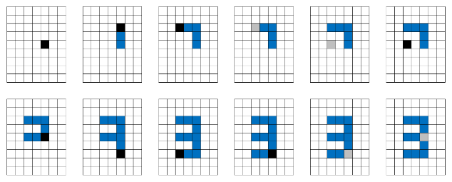

На први поглед, односно у нашем случају на прво читање, проблем делује једноставно. Међутим, при мало детаљнијој анализи или при покушају имплементације могу се уочити одређени специјални случајеви који нам, уколико се о њима добро не размисли, могу “загорчати живот“. 

Како је ограничење за дужину низа команди мало - **симулација се просто намеће**. Након симулације имамо “слику” коју треба упоредити са сликама свих цифара. Као резултат враћамо цифру чија се слика поклопила са сликом коју смо добили симулацијом. Зато се поставља питање како извршити саму симулацију? У задатку Анитица црта по ивицама решетке, тако да уколико би папир моделирали матрицом потребно је наћи начин маркирања ивица а не поља матрице. Само маркирање и не представља велики проблем, али касније морамо ту слику упоређивати са сликама других цифара, што може бити проблем.

Зато се можемо послужити триком да папир моделирамо матрицом, али да се потез симулира тако што маркирамо три поља матрице (у датом смеру). Наиме, у сваком тренутку памтимо тренутну позицију на којој се налази оловка. Означимо координате тренутне позиције са $(currentX, currentY)$. Уколико је, на пример, наредна команда повлачење оловке десно, тада поља $(currentX, currentY)$, $(currentX, currentY+1)$ и $(currentX, currentY+2)$ треба обојити уколико је оловка на папиру. За памћење стања оловке, да ли је на паприру или у ваздуху, можемо користити обичну boolean промењиву која мења вредности када наиђе на одговарајуће команде.

Симулација примера са папира. Црно поље представаља позицију оловке када је она спуштена, а сиво поље када је у ваздухy:



Како знамо да ће на крају исцртана слика представљати неку од десет цифара (услов задатка), наша симулација не може “нацртати” слику димензија већих од $6\times 3$. Нажалост, како из самог проблема не знамо тачну позицију из које Анитица креће да црта (примера ради не знамо да она увек креће из горњег-десног угла), нашу симулацију можемо започети из средине матрице. Овде се крије један мали проблем. Наиме, уколико саму симулацију вршимо тако што се увек крећемо по пољима матрице, онда матрица мора бити веома велика. Али ми знамо да је део матрице који је нама битан, део на коме су обоје поља, не може бити већи од горе наведене димензије, ми онда можемо вршити симулацију само када је оловка на папиру. Када је оловка у ваздуху ми можемо само да мењамо вредности тренутне позиције у матрици. У тренуцима када је оловка на папиру, поред мењања тренутне позиције, поља кроз која пролазимо треба маркирати (односно обојити).

Сада знамо да је потребно дефинисати малу матрицу која ће нам служити за симулацију, али се поставља питање колика димензија те матрица је потребна? Горе смо споменули да ми не знамо у коме смеру ће Анитица цртати цифре, тако да када кренемо симулацију из средине матрице, не знамо да ли ће Анитица наставити цртање доле десно или горе лево или само доле. Због тога можемо дефинисати матрицу која може прихватити цифре у свим правцима. Из ове анализе можемо закључити да је довољно матрицу дефинисати са димензијама $(3+3)\times (6+6)$.

Нажалост, у овој анализи нам се подкрао још један специјални случај – шта ако прва команда представља подизање оловке у ваздух. Уколико кренемо слимулацију одмах, може се десити да први тренутак када Анитица списти оловку буде много изван опсега наше матрице. Оно што ми знамо јесте да чим повуче прву цртицу, онда ће остатак слике бити близу те цртице. Зато је на почетку потретребно занемарити део пре прве црте коју повуче Анитице. Ово заправо представља почетни део низа комндати који се дешава “у ваздуху”.

Слике цифара:
```
###   #   ###  ###  # #  ###  ###  ###  ###  ###
# #   #     #    #  # #  #    #      #  # #  # #
# #   #   ###  ###  ###  ###  ###    #  ###  ###
# #   #   #      #    #    #  # #    #  # #    #
###   #   ###  ###    #  ###  ###    #  ###  ###
```
На крају симулације имамо стање матрице из које треба препозанти цифру. На почетку можемо дефинисати изгледе свих десет цифара и њихове слике убацити у код. Слику коју је нацртала Анитица можемо добити тако што из матрице извучемо онај део који је величине $6\times 3$ и који садржи слику (остали део слике нам није потребан). Када све ове вредности имамо, можемо упоредити наведени део подматрице са свим цифрама и вратити ону чија се слика поклапа.

## Generalizacija
Две генерализације ового проблема су биле разматране за ово такмичење. Прва је да **цифре које црта Анитица могу бити склиране**, другим речима онда може нацртана број један величине 15 узастопних цртица на горе или на доле. Овде би препознавање самих цифара било доста компликованије, јер није довољно ипитивати само пуку једнакост две подматрице.

Друга генерализације је била уколико цифре нису скалиране, али **Анитица може да погреши и да нацрта било шта**. Ово би упоређивање било идентично као и у почетној верзији проблема али би било потребно убацити још неке специјалне случајеве у аназизу. Ови специјални случајеви би служили да нам помогну у одлуци да ли да наствимо симулацију или не – на пример уколико Анитица почне да шара по папиру свуда чиме се добија велика слика која свакако није цифра. 
