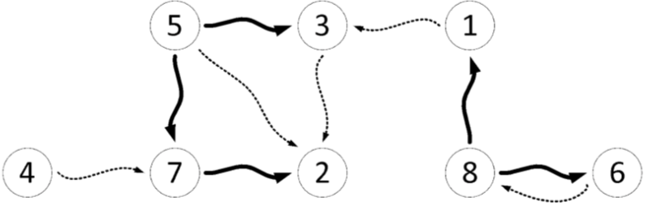

У тајванском урбаном граду Тајпеију, налази се $N$ древних чајџиница нумерисаних бројевима од $1$ до $N$. Власници ових чајџиница су саградили и $M$ **једносмерних** тајних пролаза – сваки тајни пролаз спаја неке две чајџинице а у њему су стражари који пропуштају посетиоце (сумњиве тајванске тајкуне) само у одговарајућем смеру.

Један од најсумњивијих тајванских тајкуна је натурализовани тајванац Звонко Лим који особито воли да се напије пиринчаног вина а затим да посећује поменуте тајванске чајџинице. Он има листу тих $N$ чајџиница **у редоследу  од најомиљеније до најмање омиљене** (на првој позицији је најомиљенија). Власници чајџиница не знају његову листу али ће покушати да је реконструишу на основу познавања Звонкових навика приликом обиласка чајџиница. Наиме, када се Звонко напије пиринчаног вина, он умисли да је DFS и посећује чајџинице на следећи начин:

1. На почетку се спусти хеликоптером у прву чајџиницу са своје листе.
2. Ако се тренутно налази у чајџиници број $X$, тада посматра скуп свих чајџиница до којих може доћи неким тајним пролазом из чајџинице $X$ **а које већ није обишао**:
    * Уколико је тај скуп непразан, он од свих чајџиница из тог скупа бира **најомиљенију (на основу листе)**, иде тајним пролазом до ње **успут подмићујући стражаре** и, када стигне, **понавља корак $2$**.
    * Уколико је тај скуп празан, он се враћа из чајџинице $X$ оним тајним пролазом којим је дошао до $X$ (иако је тај пролаз у супротном смеру он је већ подмитио стражаре долазећи у $X$ па му они дозвољавају да прође) и **понавља корак $2$**. Међутим, уколико је у $X$ дошао хеликоптером а не тајним пролазом, он одлази хеликоптером у најомиљенију чајџиницу коју до тада није посетио и **понавља корак $2$**.

Када обиђе **све** чајџинице на овај начин, Звонко Лим одлази кући да спава 

Власници чајџиница не знају у ком редоследу је Звонко обилазио чајџинице али познају структуру тајних пролаза и открили су **све подмићене стражаре**. Помозите им да открију **како изгледа Звонкова листа**! Уз то, ако постоји више решења, чајџиница *број $1$* ће вас частити додатним поенима ако је ставите што ближе почетку листе.

## Opisi funkcija
Потребно је да имплементирате функцију:

* `OdrediListu(N, M, c1[], c2[], g[], L[])`

где је $N$ – број чајџиница, $M$ број тајних пролаза а $c1$, $c2$ и $g$ низови дужине $M$ који описују тајне пролазе: за свако $1 \leq i\leq M$, $i$-ти тајни пролаз води од чајџинице број $c1[i]$ до чајџинице број $c2[i]$ и, уколико је $g[i]=0$, стражари у том тајном пролазу нису били подмићени (тј. Звонко се туда није кретао) а уколико је $g[i]=1$, стражари у том тајном пролазу су били подмићени (тј. туда се Звонко кретао). Низ $L$ дужине $N$ представља Звонкову листу коју **ви требате да “попуните”** (на првом месту ставити индекс његове најомиљеније чајџинице и тако редом до најмање омиљене). **Сви низови су индексирани од $1$**.

## Primer 1
Нека је $N=8$, $M=10$, $c1=[4, 5, 1, 8, 8, 6, 7, 5, 3, 5]$, $c2=[7, 7, 3, 6, 1, 8, 2, 3, 2, 2]$ и $g=[0, 1, 0, 1, 1, 0, 1, 1, 0, 0]$. Тада имамо $5$ тајних пролаза у којима су подмићени стражари (тј. којим је Звонко пролазио) – **они су означени задебљаним стрелицама на слици**. У овој ситуацији, једна од могућих Звонкових листи омиљених чајџиница је $L=[5, 8, 7, 6, 4, 1, 3, 2]$. Заиста, тада би Звонково кретање изгледало овако: На почетку се хеликоптером спусти у њему најомиљенију чајџиницу $(5)$; Из ове чајџинице он може доћи до чајџиница $2$, $3$ или $7$. 

Како му је од њих $7$ најомиљенија, од иде до ње и подмићује стражаре у пролазу $5\rightarrow 7$. Затим из $7$ одлази до $2$ (надаље се подмићивање подразумева). Сада нема где, па се враћа одакле је дошао (у чајџиницу $7$, овог пута у супротном смеру). Сада такође нема где из $7$ па се враћа у $5$. Из чајџинице број $5$ иде у $3$ јер је то његова најомиљенија чајџиница до које може доћи из $5$ а да је већ није посетио. Сада из $3$ нема где па се враћа у $5$. Сада из $5$ нема где а како је у чајџиницу број $5$ дошао хеликопетром а не тајним пролазом, онда узима хеликоптер и слеће у следећу најомињенију чајџиницу коју до сада није посетио – број $8$. Затим иде у $6$ (омиљенија му је од $1$), затим се истим пролазом (а не пролазом $6\rightarrow 8$) враћа у $8$, па затим иде у $1$ па поново назад у $8$ одакле хеликоптером одлази у $4$. Из $4$ нема пролаза који воде до необиђене чајџинице а ово је уједно последња обиђена чајџиница па Звонко одлази да спава.

Поменута Звонкова листа није најоптималнија – чајџиница $1$ може бити боље пласирана од $6$ места на листи. Листа $L=[5, 8, 1, 7, 6, 4, 3, 2]$ je једна од најоптималнијих – у њој је чајџиница $1$ на позицији $3$ (боље од овога не може). Такође приметимо да нпр. листа $L=[5, 8, 2, 7, 6, 4, 1, 3]$ није коректна: после спуштања хеликоптером у $5$, Звонко би отишао u чајџиницу број $2$ пролазом $5\rightarrow 2$, а знамо да ту није подмићивао стражаре, тј. да није пролазио туда.



## Ograničenja

* $2\leq N\leq 100.000$.
* $1\leq M\leq 300.000$.
* За свако $1\leq i\leq M$ важи $1\leq c1[i], c2[i]\leq N$, $c1[i]\neq c2[i]$ и $g[i]\in\{0,1\}$.
* Између сваке две чајџинице постоји **највише један тајни пролаз у једном смеру**.
* **Гарантује се да решење, не нужно јединствено, увек постоји.**

У сваком подзадатку, уколико ваш програм врати било коју коректну Звонкову листу (у свим тест примерима) добијате $70\%$ **поена** од одговарајућег подзадатка. Уколико је у сваком тест примеру подзадатка чајџиница $1$ најближе могуће почетку листе (а листа је и даље коректна) добијате свих $100\%$ поена тог подзадатка.
 
* ПОДЗАДАТАК $1$ [$11$ ПОЕНА]: $N\leq 8$ и $M\leq 20$.
* ПОДЗАДАТАК $2$ [$9$ ПОЕНА]: Има тачно $N-1$ тајних пролаза у којима су подмићени стражари и они образују пут дужине $N-1$.
* ПОДЗАДАТАК $3$ [$9$ ПОЕНА]: Нема подмићених стражара, тј. Звонко Лим је увек користио хеликоптер.
* ПОДЗАДАТАК $4$ [$17$ ПОЕНА]: $N\leq 500$ и $M\leq 10.000$.
* ПОДЗАДАТАК $5$ [$21$ ПОЕНА]: $N\leq 2.000$.
* ПОДЗАДАТАК $6$ [$33$ ПОЕНА]: Нема додатних ограничења.

## Detalji implementacije
Потребно је да пошаљете тачно један фајл, под називом `caj.c`, `caj.cpp` или `caj.pas`, који имплементира горе поменуту функцију. Осим тражене функције, ваш фајл може садржати и додатне глобалне променљиве, помоћне функције и додатне библиотеке.

Зависно од програмског језика који користите, ваша функција/процедура мора бити следећег облика:
```
C/C++:
    void OdrediListu(int N, int M, int* c1, int* c2, int* g, int* L);
Pascal:
    procedure OdrediListu(N, M : longint; var c1, c2, g, L : array of longint);
```

Параметри функције/процедуре су раније описани; $N$, $M$ и низови $c1$, $c2$, $g$ су улазни параметри док је низ $L$ излазни параметар.

## Testiranje i eksperimentisanje
Уз задатак, обезбеђени су вам “template” фајлови (`caj.c`, `caj.cpp`, `caj.pas`) које можете користити и мењати по потреби. Такође су вам обезбеђени програми (`grader.c`, `grader.cpp`, `grader.pas`) који служе да лакше тестирате кодове. Ови програми учитавају са стандардног улаза следеће податке:

* У првом реду бројеве $N$ и $M$, раздвојене размаком;
* У следећих $M$ редова бројеве $c1[i]$, $c2[i]$, $g[i]$ raздвојене размаком;

затим позивају вашу функцију `OdrediListu` из одговарајућег фајла (`caj.c`, `caj.cpp` или `caj.pas`) са учитаним параметрима и на крају вредности низа `L` исписују на стандардни излаз – `N` бројева раздвојених размаком у једном реду. Kодове ових програма можете мењати по потреби.