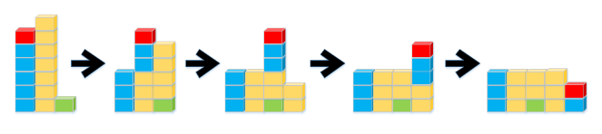

---
hide:
  - toc
---

# B1 - Ljute ptice

=== "Zadatak"
	
	| Vremensko ograničenje | Memorijsko ograničenje |
	|:-:|:-:|
	| 500ms | 64MB |
	
	Kako je proleće donelo lepo vreme, tajna komisija je organizovala zanimljiv događaj u centru jednog lepog grada. Naime oni su tajno, dok su svi spavali, napravili kule od stiropora koje stoje jedna pored druge. Svaka kula je sačinjena od stiropornih blokova koji su stavljeni jedan na drugi. Pored kula se nalazi praćka iz koje će se ispaljivati poznate ljute ptice od stiropora. Praćka na početku može da se podesi na visinu $h$ i do kraja će ispaljivati ptice samo na toj visini horizontalno u odnosu na zemlju. Kada se ptica ispali ona leti u smeru ka kulama ne gubeći visinu i kada naleti na kulu visine $h$ ili više, udara u nju, te pomera pogođeni blok kao i sve blokove koji se nalaze iznad bloka u koji je udarila za jedno mesto u smeru u kom je putovala. Kako i ovde važe zakoni fizike, ukoliko blok treba da se pomeri za jedno mesto, a na tom mestu se nalazi drugi blok, i taj drugi blok će se pomeriti za jednu mesto u smeru pomeranja prvog bloka. Isto tako deluje i gravitacija, te ukoliko se neki blok pomeri za jedno mesto i ne postoji blok ispod njega, on pada sve dok ne padne na zemlju ili neki drugi blok. Ptice se ispaljuju sve dokle pogađaju neki blok, a ukoliko ptica ne pogodi nijedan blok, prekida se ispaljivanje.
	
	Tajna komisija je sakrila veoma vrednu nagradu (neki je zovu „10 poena“) u jednom od stiropornih blokova te će posle ispaljivanja ptica tražiti od učesnika da nađe taj blok. Miroslav je od tajnog izvora saznao gde će tajna komisija sakriti tu nagradu i odlušio je da postavi praćku na visinu $k$. Međutim kako je on tek četvrti razred osnovne škole, od vas traži da mu pomognete i kažete gde će se posle ispaljivanja svih ptica nalaziti blok u kom se nalazi nagrada.
	
	## Ulaz
	U prvom redu standardnog ulaza se nalaze prirodni brojevi $n$ i $k$, koji redom označavaju broj kula i visina na kojoj Miroslav hoće da ispaljuje ptice od stiropora. U sledećem redu se nalazi $n$ prirodnih brojeva $(h_1,h_2,\ldots,h_n)$ koji označavaju visine kula. U trećem redu standardnog ulaza se nalaze brojevi $rk$ i $hb$ koji redom označavaju redni broj kule i visinu bloka u kojem se nalazi nagrada.
	
	## Izlaz
	U prvi i jedini red standardnog izlaza potrebno je ispisati gde će se nalaziti blok sa nagradom. Prvo se ispisuje redni broj mesta na kom će se nalaziti, a zatim i na kojoj visini će se nalaziti.
	
	## Primer 1
	### Ulaz
	```
	3 4
	6 7 1
	1 6
	```
	
	### Izlaz
	```
	5 2
	```
	
	## Objašnjenje primera
	Blokovi označeni istom bojom su blokovi koji sačinjavaju jednu kulu na početku pre ispaljivanja ljutih ptica. Crveni blok je blok u kome se nalazi nagrada – on će se na kraju nalaziti na mestu broj $5$ (dobili smo dve nove “kule”) na visini $2$.
	
	
	
	## Ograničenja
	
	* $1 \leq n \leq 10^6$.
	* Svi ostali brojevi iz ulaza su prirodni brojevi ne veći od $10^9$.
	* $1\leq rk \leq n$ i $1\leq hb \leq h_rk$, tj. garantuje se da zadati blok u kom se nalazi nagrada postoji.
	
	Test primeri su podeljeni u četiri disjunktne grupe:
	
	* U test primerima vrednim $10$ poena važi $n = 1$.
	* U test primerima vrednim $20$ poena važi $h_i = h_j$, za svako $1 \leq i,j \leq n$.
	* U test primerima vrednim $30$ poena važi $h_i, n\leq 100$, za svako $1\leq i\leq n$.
	* U test primerima vrednim $40$ poena nema dodatnih ograničenja.
	

=== "Rešenje"
	
	| Autor | Tekst i test primeri | Analiza rеšenja | Testiranje |
	|:-:|:-:|:-:|:-:|
	| Nikola Milosavljević | Demjan Grubić | Marko Ilić | Boris Grubić |
	
	##  Rešenje za $n = 1$
	Prvo treba primetiti da ukoliko se blok sa nagradom nalazi ispod nivoa praćke, da se neće uopšte pomeriti. Posmatrajmo sada slučaj kada je iznad ili na njenoj visini. U konačnom rasporedu blokova imaćemo seriju kula visine $k-1$ i eventualno još jednu kulu manje visine. Sada jednostavnom aritmetikom treba odrediti tačno u kojoj kuli će se blok sa nagradom naći i na kojoj visini. Vremenska složenost: $O(1)$. Memorijska složenost: $O(n)$.
	
	## Rešenje kada su sve kule iste visine
	Ponovo, ako je blok sa nagradom ispod visine praćke, ostaće tu. Ukoliko nije, možemo posmatrati kule sa desna na levo i sa svake skinuti blokove koji su na visini barem $k$, a potom ih redom pakovati u nove kule koje ćemo postaviti skroz desno. Vremenska složenost: $O(n)$. Memorijska složenost: $O(n)$.
	
	## Rešenje za $1 \le n, h_i \le 100$
	Kada je blok sa nagradom ispod nivoa praćke, neće se pomerati. Posmatrajmo drugi slučaj. U ovom podzadatku možemo ponovo ići sa desna na levo i sada za svaku kulu posmatrati blokove odozdo na gore, a potom za svaki blok možemo naći prvu kulu na desno na koju može da stane. Vremenska složenost: $O(maxh_i \cdot n^3)$. Memorijska složenost: $O(n^2)$.
	
	## Glavno rešenje
	Slično, kao u prethodnim podzadacima, obilazićemo kule sa desna na levo. Možemo primetiti da kada se neki blokovi pomeraju na desno, oni popunjavaju najbliža upražnjena mesta na desnoj strani. Dakle, pri obilasku kula, ukoliko je neka kula niza od praćke(ima praznih mesta), možemo je postaviti kao prvu poziciju koju će kule levo popunjavati ako imaju višak blokova. Dok, ukoliko posmatrana kula ima višak blokova, možemo popunjavati prazna mesta, sve dok ne iskoristimo sve kule koje su višak. Struktura koju možemo koristiti za ovo je *std::stack* u *C++*. Vremenska složenost: $O(n)$. Memorijska složenost: $O(n)$.
	
	``` cpp title="01_ljute_ptice.cpp" linenums="1"
	#include <iostream>
	#include <stdio.h>
	#include <assert.h>
	#include <cstring>
	using namespace std;
	
	#define MaxN 1000010
	
	int n,k;
	int h[MaxN];
	int rk, hb;
	
	int main()
	{
		scanf("%d%d",&n,&k);
		for (int i = 0; i < n; ++i)
			scanf("%d",&h[i]);
		scanf("%d%d",&rk,&hb);
	
		long long retr = -1LL;
		long long reth = hb;
		
	    if ( hb >= k )
	    {
	        rk--;
	
	        long long count = hb - k + 1;
	
	        for (int i = rk + 1; i < n; ++i)
	        {
	            if (k > h[i])
	            {
	                if (h[i] + count >= k)
	                {
	                    count -= k - h[i] - 1;
	                }
	                else
	                {
	                    retr = i + 1;
	                    reth = h[i] + count;
	                    break;
	                }
	            }
	            else
	            {
	                count += h[i] - k + 1;
	            }
	        }
	
	        if (retr == -1LL)
	        {
	            retr = n + (count + k - 2) / (k - 1);
	            reth = (count-1) % (k-1) + 1;
	        }
	
		}
	
		if (retr == -1LL) retr = rk;
	
		printf("%lld %lld\n",retr,reth);
	
		return 0;
	}
	```
