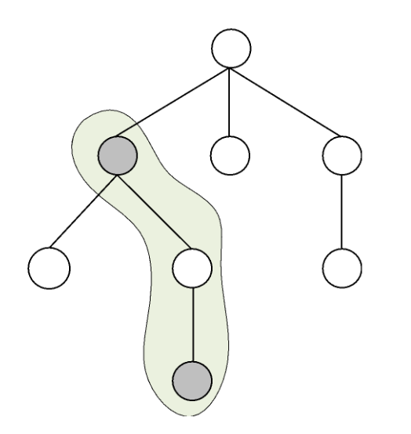

Анитица се бацила на велико пролећно спремање своје собе. Током сређивања је наишла на веома занимљиву слику – породично стабло њене породице. Поред имана предака приметила је и бројеве, за које претпоставља да представљају њихове срећне бројеве. Како јој је сређивање веома брзо досадило, смислила је занимљиву игрицу са породичним стаблом. 

Позвала је своју симпатију и питала га да замисли и каже јој било који број.  Затим би Анитица тражила **пут од неког чвора породичног стабла до неког његовог претка и на том путу сабирала неке срећне бројеве** (другим речима није морала сабрати све срећне бројеве на том путу већ само оне које она жели). Анитица дефинише пут, као низу предака тако да је сваки наредни директни потомак претходног, другим речима да увек из неког чвора силазимо у чвор неког његовог детета. **Анитица жели да дата сума срећних бројева буде што приближнија броју који је њена симпатија рекла.**

Анитица се договорила са својом симпатијом да уколико нађе најближу суму броју који је он замислио, да ће јој он помоћи у пролећном сређивању собе (када кажемо помогне мислимо да ће он све сам средити). Помозимо Анитице како би могла да ужива у овим топлим пролећним данима.

## Ulaz
Први ред стандардног улаза садржи два природна број $N$ и $S$, који представљају број чворова у породичном стаблу и број који је њена симпатија замислила, редом. У наредних $N$ редова, налази се опис породичног стабла. Чворови стабла су означени бројевима од $1$ до $N$. $(k+1)$-tи ред улаза садржи опис чвора, низ бројева одвојених знаком размака, са индексом $k$. Први број, $s_k$, представља срећан број датог чвора. Други број $d_k$ представља број потомака тог чвора. Наредних $d_k$ бројева представљају индексе његових директних потомака.

## Izlaz
Први и једини ред стандардног излаза треба да садржи најприближнију суму срећних бројева на неком путу датом броју $S$. Уколико постоји више решења, штампати најмање.

## Primer 1
### Ulaz
```
8 20
22 3 2 3 4
7 2 6 5
100 0
1 1 7
10 0
2 1 8
2 0
12 0
```

### Izlaz
```
19
```

## Objašnjenje primera
Најближа сума срећних бројва броју $20$ је сума бројева са чвора $2$ и чвора $8$, где се добија сума $7+12=19$. Пут је на слици “заокружен” а црном бојом су обојени чворови са који сабирамо вредности. Приближнија сума се не може добити (у овом случају то значи да не постоји пут који има суму $20$).



## Ograničenja

* $1\leq N\leq 10.000$.
* $1\leq S\leq 10.000$.
* Срећни бројеви чворова су из сегмента $[1, 100.000]$.
* Обратити пажњу на меморијско ограничење.

Тест примери су подељени у tri дисјунктне групе: 

* У тест примерима вредним $10$ поена важи $N\leq 10$.
* У тест примерима вредним $20$ поена важи $N\leq 100$ и $S\leq 10000$.
* У тест примерима вредним $20$ поена важи $N\leq 1000$ и $S\leq 10000$.
* У тест примерима вредним $50$ поена нема додатних ограничења.
