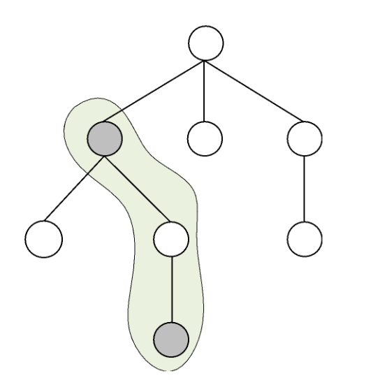

---
hide:
  - toc
---

# A2 - Porodično stablo

=== "Zadatak"
	
	| Vremensko ograničenje | Memorijsko ograničenje |
	|:-:|:-:|
	| 500ms | 2MB |
	
	Anitica se bacila na veliko prolećno spremanje svoje sobe. Tokom sređivanja je naišla na veoma zanimljivu sliku – porodično stablo njene porodice. Pored imana predaka primetila je i brojeve, za koje pretpostavlja da predstavljaju njihove srećne brojeve. Kako joj je sređivanje veoma brzo dosadilo, smislila je zanimljivu igricu sa porodičnim stablom.
	
	Pozvala je svoju simpatiju i pitala ga da zamisli i kaže joj bilo koji broj.  Zatim bi Anitica tražila **put od nekog čvora porodičnog stabla do nekog njegovog pretka i na tom putu sabirala neke srećne brojeve** (drugim rečima nije morala sabrati sve srećne brojeve na tom putu već samo one koje ona želi). Anitica definiše put, kao nizu predaka tako da je svaki naredni direktni potomak prethodnog, drugim rečima da uvek iz nekog čvora silazimo u čvor nekog njegovog deteta. **Anitica želi da data suma srećnih brojeva bude što približnija broju koji je njena simpatija rekla.**
	
	Anitica se dogovorila sa svojom simpatijom da ukoliko nađe najbližu sumu broju koji je on zamislio, da će joj on pomoći u prolećnom sređivanju sobe (kada kažemo pomogne mislimo da će on sve sam srediti). Pomozimo Anitice kako bi mogla da uživa u ovim toplim prolećnim danima.
	
	## Ulaz
	Prvi red standardnog ulaza sadrži dva prirodna broj $N$ i $S$, koji predstavljaju broj čvorova u porodičnom stablu i broj koji je njena simpatija zamislila, redom. U narednih $N$ redova, nalazi se opis porodičnog stabla. чvorovi stabla su označeni brojevima od $1$ do $N$. $(k+1)$-ti red ulaza sadrži opis čvora, niz brojeva odvojenih znakom razmaka, sa indeksom $k$. Prvi broj, $s_k$, predstavlja srećan broj datog čvora. Drugi broj $d_k$ predstavlja broj potomaka tog čvora. Narednih $d_k$ brojeva predstavljaju indekse njegovih direktnih potomaka.
	
	## Izlaz
	Prvi i jedini red standardnog izlaza treba da sadrži najpribližniju sumu srećnih brojeva na nekom putu datom broju $S$. Ukoliko postoji više rešenja, štampati najmanje.
	
	## Primer 1
	### Ulaz
	```
	8 20
	22 3 2 3 4
	7 2 6 5
	100 0
	1 1 7
	10 0
	2 1 8
	2 0
	12 0
	```
	
	### Izlaz
	```
	19
	```
	
	## Objašnjenje primera
	Najbliža suma srećnih brojva broju $20$ je suma brojeva sa čvora $2$ i čvora $8$, gde se dobija suma $7+12=19$. Put je na slici “zaokružen” a crnom bojom su obojeni čvorovi sa koji sabiramo vrednosti. Približnija suma se ne može dobiti (u ovom slučaju to znači da ne postoji put koji ima sumu $20$).
	
	
	
	## Ograničenja
	
	* $1\leq N\leq 10.000$.
	* $1\leq S\leq 10.000$.
	* Srećni brojevi čvorova su iz segmenta $[1, 100.000]$.
	* Obratiti pažnju na memorijsko ograničenje.
	
	Test primeri su podeljeni u tri disjunktne grupe:
	
	* U test primerima vrednim $10$ poena važi $N\leq 10$.
	* U test primerima vrednim $20$ poena važi $N\leq 100$ i $S\leq 10000$.
	* U test primerima vrednim $20$ poena važi $N\leq 1000$ i $S\leq 10000$.
	* U test primerima vrednim $50$ poena nema dodatnih ograničenja.
	

=== "Rešenje"
	
	| Autor | Tekst i test primeri | Analiza rеšenja | Testiranje |
	|:-:|:-:|:-:|:-:|
	| Dušan Zdravković | Andreja Ilić | Uroš Kostadinović | Dušan Zdravković |
	
	## Prvi podzadatak
	Možemo isprobati svih $2^n$ mogućih podskupova za rešenje. Proveravamo da li su čvorovi na istom putu koristeći $in$ i $out$ vreme u *DFS* obilasku. Vremenska složenost $O(2^n)$.
	
	## Drugi podzadatak
	Ako nam je optimalno rešenje kada je suma brojeva veća od $S$, onda ćemo brisanjem bilo kog broja dobiti sumu manju od $S$. Za svaki list posmatrajmo put od korena do njega. Naći ćemo sve moguće vrednosti sume manje od $S$ na tom putu koristeći problem ranca. Kada dodajemo novi čvor u ranac i dobijemo da možemo da napravimo neku sumu veću od $S$ uzećemo tu sumu kao kandidata za rešenje, kao i sve moguće sume manje od $S$. Vremenska složenost: $O(N^2S)$. Memorijska složenost: $O(NS)$.
	
	## Treći podzadatak
	Za svaki čvor čuvaćemo niz $dp_i$ tako da je $dp_i,s$ jednako 1 ako je moguće da napravimo sumu $s$ u podstablu čvora $i$. *DFS* obilaskom ćemo računati ove vrednosti, tako što prvo izračunamo vrednosti za decu nekog čvora i onda radimo slično kao u problemu ranca. Vremenska složenost: $O(NS)$. Memorijska složenost: $O(NS)$.
	
	## Glavno rešenje
	U rešenju za treći podzadatak nam je problem memorija. Za svaki čvor “teško” dete zovemo ono dete sa najvećim velićinom podstabla (ako ih ima više izaberemo proizvoljno), dok su sva ostala deca “laka”.  U *DFS* obilasku za čvor $u$ ćemo prvo izračunati vrednosti za teško dete i vrednosti za njega upisivati na mesto koje je predvićeno za čvor $u$, dok kada idemo u lako dete vrednosti ćemo upisivati u novi niz. Kada nam neki niz više nije potreban vratićemo mu sve vrednosti na $0$ i iskoristiti za neki drugi čvor. Na ovaj način će nam biti potrebno $O(logN)$ nizova dužine $S$, jer ćemo novi niz koristiti samo kada idemo u lako dete, a to ćemo uraditi maksimalno $O(logN)$ puta jer svaki put veličinu podstabla barem prepolovimo. Vremenska složenost: $O(NS)$. Memorijska složenost: $O(SlogN)$.
	
	
	``` cpp title="05_porodicno_stablo.cpp" linenums="1"
	#include<stdio.h>
	#include <stdlib.h>
	#include<vector>
	#include<math.h>
	#include<ctime>
	
	#define MAX_N 10005
	#define MAX_S 10005
	
	
	int N, S, sol, s[MAX_N], parent[MAX_N], added[2 * MAX_S], numAdded[MAX_N], k;
	std::vector<int> children[MAX_N];
	bool d[MAX_S * 2 + 1], mark[2 * MAX_S + 1];
	
	void input()
	{
		scanf("%d %d", &N, &S);
		int deg, child;
		for (int i = 1; i <= N; i++)
		{
			parent[i] = -1;
		}
		for (int i = 0; i < N; i++)
		{
			scanf("%d %d", &s[i + 1], &deg);
			for (int j = 0; j < deg; j++)
			{
				scanf("%d", &child);
				children[i + 1].push_back(child);
				parent[child] = i + 1;
			}
		}
	#endif
	}
	
	void Visit(int node)
	{
		numAdded[node] = 0;
		for (int currentS = 2 * MAX_S; currentS >= 0; currentS--)
		{
			if (d[currentS])
			{
				if ((currentS + s[node] <= 2 * MAX_S) && (!d[currentS + s[node]]))
				{
					added[k] = currentS + s[node];
					k++;
					numAdded[node]++;
					d[currentS + s[node]] = true;
					mark[currentS + s[node]] = true;
	
					if (abs(currentS + s [node] - S) < abs(sol - S) ||
						((abs(currentS + s [node] - S) == abs(sol - S)) && (currentS + s[node] < sol)))
					{
						sol = currentS + s[node];
					}
				}
			}
		}
		for(int i = 0; i < children[node].size(); i++)
		{
			Visit(children[node][i]);
		}
		for (int i = 0; i < numAdded[node]; i++)
		{
			d[added[k - i - 1]] = false;
			added[k - i - 1] = 0;
		}
		k = k - numAdded[node];
	}
	
	void solve()
	{
		int rootNode = 1;
		while (parent[rootNode] != -1)
		{
			rootNode++;
		}
		for (int i = 1; i <= 2 * MAX_S; i++)
		{
			d[i] = false;
			mark[i] = false;
		}
		d[0] = true;
		sol = 0;
		k = 0;
		Visit(rootNode);
	}
	
	void output()
	{
		printf("%d\n", sol);
	}
	
	int main()
	{
		input();
		solve();
		output();
		return 0;
	}
	```
