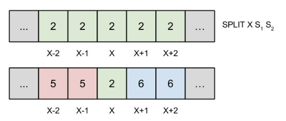

Проблем Сплит је један од тежих проблема на другим Квалификацијама, и да би се потпуно решио потребно је знање напреднијих структура података (ниво Српске Информатичке Олимпијаде). Инспирација за задатак је потекла од задатка Жетони са СИО 2012. када је аутор (тадашњи такмичар) употребио сличну методу ”сплитова” да би решио задатак.

Задатак се може превести у формални облик на више начина; ево једне могуће интерпретације:

> Задата је функција са скупа природних бројева на скуп стрингова, $f: N\rightarrow \Sigma$, тако да у почетку важи $f(n)=S$ за све $n$. Сплит операцијом на позицији $X$ са стринговима $S_1$ u $S_2$ функција $f$ се мења у функцију $f'$ тако да важи:
    
> * $f'(x) = S_1$ ако $x < X \land f(x)=f(X)$.
> * $f'(x) = S_2$ ако $x>X \land f(x)=f(X)$.
> * $f'(x) = f(x)$ иначе.

> Потребно је одредити f(n) сваки пут када се позове query операција на позицији n.

Задатак се може решити тако што одржавамо структуру **интервала**, где за сваки интервал памтимо неки јединствени идентификатор, леву и десну границу, као и стринг који означава програм који се тренутно извршава на том интервалу. У почетку постоји само један интервал, $I_0$, тако да важи: $I_0.L = 1$, $I_0.R = N$, $I_0.prog=S$. Неопходно је памтити који је последњи направљени интервал.

У исто време треба одржавати и низ $map$, тако да $map[n]=x$ значи да се поље $n$ тренутно налази унутар интервала $I_x$. Наравно, у почетку је $map[i]=0$ за све $i$. Одржавањем овог низа добијамо једноставан одговор на све $QUERY$ $X$ упите; довољно је вратити $I_{map(X)}.prog$.

Посматрајмо сада како одржавати *map* током неке сплит операције:

На слици ispod се налази низ *map*, пре и после сплит операције на пољу $x$. Поља у интервалу $[x-2, x+2]$ су под контролом интервала $I_2$, а последњи до сада направљени интервал је $I_4$.

Сплит операција креира два нова интервала, $I_5$ и $I_6$, и додељује им следеће параметре:

$$ 
I_5.L=I_2.L,     I_5.R=x-1,     I_5.prog=S_1; 
$$

$$
I_6.L=x+1,     I_6.R=I_2.R,     I_6.prog=S_2.
$$

Такође се низ $map$ ажурира као на слици, и $I_2.L = I_2.R = x$.

Наивно решење које одржава низ *map* тако што при свакој сплит операцији преписује све његове чланове обухваћене неким интервалом није довољно ефикасно и доноси oko $50$ бодова. Да бисмо закорачили ка комплетном решењу не смемо експлицитно чувати овај низ у меморији; уместо тога одржаваћемо низ $pmap$, где ће $map[n]$ бити сума свих елемената низа $pmap$ од првог до $n$-тог; формалније:

$$
map[n]=\sum_{i=1}^{n} pmap[i]
$$

Очигледно је да у почетку $pmap[x]=0$ за све $x$. Приметимо да, уколико желимо да на неком интервалу $[l, r]$ повећамо све вредности низа $map$ за $k$, довољно је урадити:

$$
pmap[l] = pmap[l] + k
$$

$$
pmap[r] + 1 = pmap[r+1] - k
$$

Назваћемо ову методу $update(l,  r,  k)$. Могуће је извршити сплит операцију са константним бројем позивања ове методе; aко претпоставимо да желимо извршити сплит операцију на пољу $x$, да је $I_{id}$ интервал који обухвата $x$, и да је $I_w$ последњи направљени интервал до сад, сплит операција се може описати следећим алгоритмом:

* Направити интервале $I_{w+1}$ и $I_{w+2}$ као што је раније описано.
* Ажурирати $pmap$ тако да $map[n]=0$ за све $n \in I_{id} \rightarrow update(I_{id}.L,  I_{id}.R,  -id)$.
* Aжурирати $pmap$ тако да $map[n] = w+1$ за све $n \in I_{w+1} \rightarrow update(I_{id}.L, x-1, w+1)$.
* Aжурирати $pmap$ тако да $map[n] = w+2$ за све $n \in I_{w+2} \rightarrow update(x+1,  I_{id}.R,  w+2)$.
* Aжурирати $pmap$ тако да $map[n] = id$ за $n=x \rightarrow update(x,  x,  id)$.
* Ажурирати интервал $I_{id}$ као што је раније описано.

Напоменимо да се неки од ових корака требају променити или прескочити у случају да је поље $x$ на левој или десној ивици интервала $I_{id}$. Са тренутном имплементацијом операције $update$, која ради у сложености $O(1)$, неопходно је сваки пут поново сумирати све неопходне елементе низа $pmap$ када имамо команду $QUERY$; ово је сложености $O(n)$, тако да је приступ и даље неефикасан и доноси oko $60$ бодова.

Да бисмо ефикасније одређивали суме првих $n$ елемената низа $pmap$, неопходно је користити структуру која се зове *Фенвиково стабло (Fenwick tree / Binary Indexed Tree / BIT)* које нам омогућава да рачунамо ове суме у временској сложености $O(log n)$  по цену тога да и $update$ операција мора бити сложености $O(log n)$. Ово нам даје укупну временску сложеност $O(N+Q\cdot log N)$, која је довољна за добијање $100$ бодова.