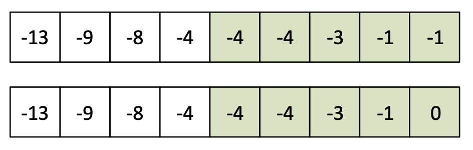

Полагање испита је био најлакши проблем за А категорију и као такав није захтевао неку специјалну теорију. Међутим, иако идеја решења није тешка (уз мало анализе се просто намеће), уколико се имплементацији приступи олако може доћи до прегршт специјалних случајева. Ово се обично јавља код геометријских проблема – лака идеја али напорна имплементација уколико се не проведе мало више времена уз папир и оловку.

Проблем можемо превести на мало формалнији језик: за дати низ целих бројева дужине $n$, изабрати подниз, не нужно узастопних елемената, дужине $k$ који има максимални производ. Прву ствар коју можемо запазити јесте да желимо да бројеви који улазе у дати подниз буду “што већи”, како би и њихов производ био што већи. Израз “што већи” је стављен под наводнике, а ускоро ћем објаснити разлог за то. 

Посматрајмо за почетак једноставнију верзију проблема – када су елементи низа природни бројеви (другим речима нуле и позитивне вредности). Како нема негативних вредности, највише нам се исплати да узимамо бројеве који су највећи – највећих $k$ елемената низа. Дакле, решење једноставнијег проблема захтева сортирање низа а за резултат се враћа највећих $k$ елеманата.

Шта се толико разликује када дозвољавамо да бројеви буду негативни? Доста тога се мења, почев од тога да уколико посматрамо два најмања елемента која су негативна, њихов производ је позитиван и може бити већи од производа два највећа елемента низа (која су позитивна). Специјалан случај када имамо низ за свим негативним бројевима такође може да нам зада главобоље уколико га не приметимо на почетку. Нпр. уколико су сви елементи низа негативни, а имамо да је $k$ непаран број, тада имамо да је производ било ког подниза дужине $k$ негативан. Зато решење у том случају представљају највећих $k$ елемената низа. Из изложеног видимо да се морамо мало више посветити анализом проблема како не би има гомилу *if* прећеним *else* у коду.

Пример са негативним вредностима кадa je $k$ непарно:

Како се могу уобличити горе изнесени примери? Ми желимо да изаберемо $k$ елемената са највећом апсолутном вредношћу, али под условом да негативних бројева има паран број. На тај начин се добија позитивно решење. Међутим, некада није могуће изабрати бројеве тако да имамо паран број негативних елемената. Да ли тај случај можемо лако описати? Уколико имамо барем један позитиван број, тада он може променити парност броја изабраних негативних елеменатa. Другим речима, уколико имамо барем једна позитиван елемент, тада подниз који даје решење има ненегативан производ. Дакле, први случај представља низ који нема позитивне елементе и када је $k$ непарно. У овом случају имамо да је решење производ $k$ највећих елемената – погледати пример на слици $1$.

Размотримо сада генералнији случај – када имамо барем један позитиван елемент низа. Претпоставимо да је дати низ сортиран у неопадајућем поретку. Како смо већ напоменули, желимо да узимамо елементе са највећим апсолутним вредностима, али тако да имамо паран број елемената који су мањи од нуле. ОК, зашто онда не би смо узели управо највећих $k$ елемената низа по апсолутној вредности. Уколико имамо паран број негативних, нашли смо решење. Шта у случају да их имамо непран број? Тада или убацујемо још један негативан а избацујемо позитиван, или обрнуто. Наравно поново нам се исплати да убачени има што већу апсолутно вредност. Дакле, имамо два случаја:

* Избацујемо најмањи позитиван број, а убацујемо следећи највећи негативни број
* Избацујемо највећи негативан број, а убацујемо следећи највећи позитиван број

Наравно, узимамо ону опцију која нам даје већи производ. За ово није потребно рачунати сам производ, пошто се у ова два случају изабрани поднизови од $k$ елемената разликују само у два елемента. Зато је довољно само упоредити промене настале овим заменама.

Можемо прокоментарисати и начин сортирања низа. Наиме, како максимална вредност елемената не прелази $10^6$ по апсолутној вредности, низ можемо сортирати методом пребројавања (енг. *counting sort*). Међутим, како се користи овај сорт у случају када имамо и негативне вредности (пошто не можемо индексирати елементе низа негативним бројевима). Ово се може решити тако што на почетку свим вредностима додамо $10^6$, чиме добијамо да су сви елементи позитивни и из сегмента $[0, 2\cdot 10^6]$. Сада можемо применити метод пребројавања. Након сортирања, свим вредностима елемента одузимамо $10^6$, чиме добијамо сортирани почетни низ. Ово се може оптимизовати за мање случајеве тиме што се не додаје односно одузима вредност $10^6$, већ апсолутна вредност минималног елемента.

Сложеност овог алгоритма је $O(m+k)$, где је $m$ апсолутна вредност минималног елемента. Заиста, сложеност описаног сортирања је $O(m)$, док је наведени алгоритам за тражење подниза линеарне сложености по дужини подниза.
