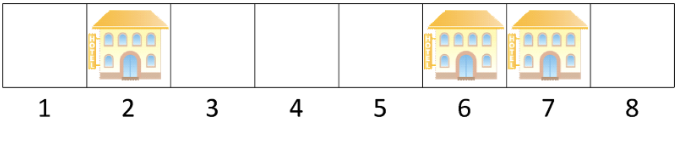

Тајван, древна острвска земља, надалеко је позната по нинџама, Acer-у и дугачким и лепим плажама. Дуж једне од таквих плажа налази се $N$ одмаралишта, нумерисаних бројевима од $1$ до $N$, **редом**, с лева на десно. Растојање између два узастопна одмаралишта је тачно $1$ км; специјално, растојање између одмаралишта број $i$ и одмаралишта број $j$ је $|i-j|$ километара за свако $1\leq i,j\leq N$.

Ових дана, актуелна је вест да сумњиви руски бизнисмени из Црне Горе планирају да у неким одмаралиштима саграде луксузне хотеле. За свако одмаралиште **је познато да ли је у њему могуће саградити хотел или не** (уколико је могуће, није нужно саградити хотел у њему). Када се хотели буду саградили, одредиће се **поредак одмаралишта по популарности** на следећи начин: одмаралиште $i$ ће бити популарније од одмаралишта $j$ акo i samo ako је:

* Растојање од одмаралишта $i$ до њему најближег хотела мање од растојања одмаралишта $j$ до њему најближег хотела; **или**
* претходно поменута растојања су иста и важи $i<j$.

На пример, уколико имамо $8$ одмаралишта и хотели су саграђени у одмаралиштима број $2$, $6$ и $7$ тада је поредак одмаралишта по популарности (почевши од најпопуларнијег): $2$, $6$, $7$, $1$, $3$, $5$, $8$, $4$. На пример, одмаралиште $6$ је популарније од одмаралишта $5$ јер је одмаралишту $6$ најближи хотел на растојању $0$, док је одмаралишту $5$ најближи хотел на растојању $1$. Слично, одмаралиште $3$ је популарније од одмаралишта $5$ јер су им најближи хотели подједнако удаљени и важи $3<5$, итд.



Међутим, стари натурализовани тајванац Станоје Хванг поседује одмаралиште број $X$, срећни број $P$ и већину руских бизнисмена па, сасвим природно, **жели да се хотели саграде тако да одмаралиште број $X$ буде $P$-то по популарности**. На колико начина се то може урадити? 

## Opisi funkcija
Потребно је да имплементирате функцију:

* `BrojIzgradnji(N, X, P, H[])`;

где је $N$ – број одмаралишта, $X$ – редни број одмаралишта које поседује Станоје, $P$ – Станојев срећни број и $H$ – низ дужине $N$ (индексиран од $1$) који означава у којим одмаралиштима се могу саградити хотели: уколико је $H_i=1$, у i-том одмаралишту се може саградати хотел; у супротном је $H_i=0$. Ова функција мора да врати један цео број – број начина на који се могу изградити хотели тако да сви поменути услови буду задовољени по модулу $1.000.000.007$ $(10^9+7)$.

## Primer 1
Нека је $N=10$, $X=5$, $P=4$ и $H=[0, 0, 0, 1, 0, 1, 0, 0, 1, 1]$. Тада постоји тачно $4$ начина да се изграде хотели тако да одмаралиште број $5$ буде $4$. по популарности и ти начини су: 


Према томе, у овом случају ваша функција мора да врати $4 \text{ MOD } 1.000.000.007=4$.

## Ograničenja

* $1 \leq N \leq 300$.
* $1 \leq X \leq N$.
* $1 \leq P \leq N$.
* Za svako $1 \leq i \leq N$ važi $H[i] \in \{0, 1\}$.

Podzadaci:

* ПОДЗАДАТАК $1$ [$12$ ПОЕНА]: $N\leq 20$.
* ПОДЗАДАТАК $2$ [$13$ ПОЕНА]: $N\leq 25$, $X=1$ и $H[i]=1$ за свако $1\leq i \leq N$.
* ПОДЗАДАТАК $3$ [$18$ ПОЕНА]: $P=N$.
* ПОДЗАДАТАК $4$ [$21$ ПОЕНА]: $N\leq 100$. 
* ПОДЗАДАТАК $5$ [$36$ ПОЕНА]: Нема додатних ограничења.

## Detalji implementacije
Потребно је да пошаљете тачно један фајл, под називом `hoteli.c`, `hoteli.cpp` или `hoteli.pas`, који имплементира горе поменуту функцију. Осим тражене функције, ваш фајл може садржати и додатне глобалне променљиве, помоћне функције и додатне библиотеке.

Зависно од програмског језика који користите, ваша функција/процедура мора бити следећег облика:
```
C/C++:
    int BrojIzgradnji(int N, int X, int P, int* H);
Pascal:
    function BrojIzgradnji(N, X, P : longint; H : array of longint) : longint;
```

## Testiranje i eksperimentisanje
Уз задатак, обезбеђени су вам “template” фајлови (`hoteli.c`, `hoteli.cpp`, `hoteli.pas`) које можете користити и мењати по потреби. Такође су вам обезбеђени програми (`grader.c`, `grader.cpp`, `grader.pas`) који служе да лакше тестирате кодове. Ови програми учитавају са стандардног улаза следеће податке:

* У првом реду бројеве $N$, $X$ и $P$, редом, раздвојене размаком;
* У другом реду низ $H – N$ бројева $H[i]$ раздвојених размаком;

затим позивају вашу функцију `BrojIzgradnji` из одговарајућег фајла (`hoteli.c`, `hoteli.cpp`, `hoteli.pas`) са учитаним параметрима и на крају вредност коју ваша функција враћа исписују на стандардни излаз. Kодове ових програма можете мењати по потреби.
