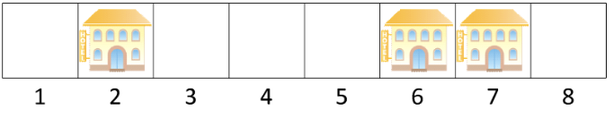
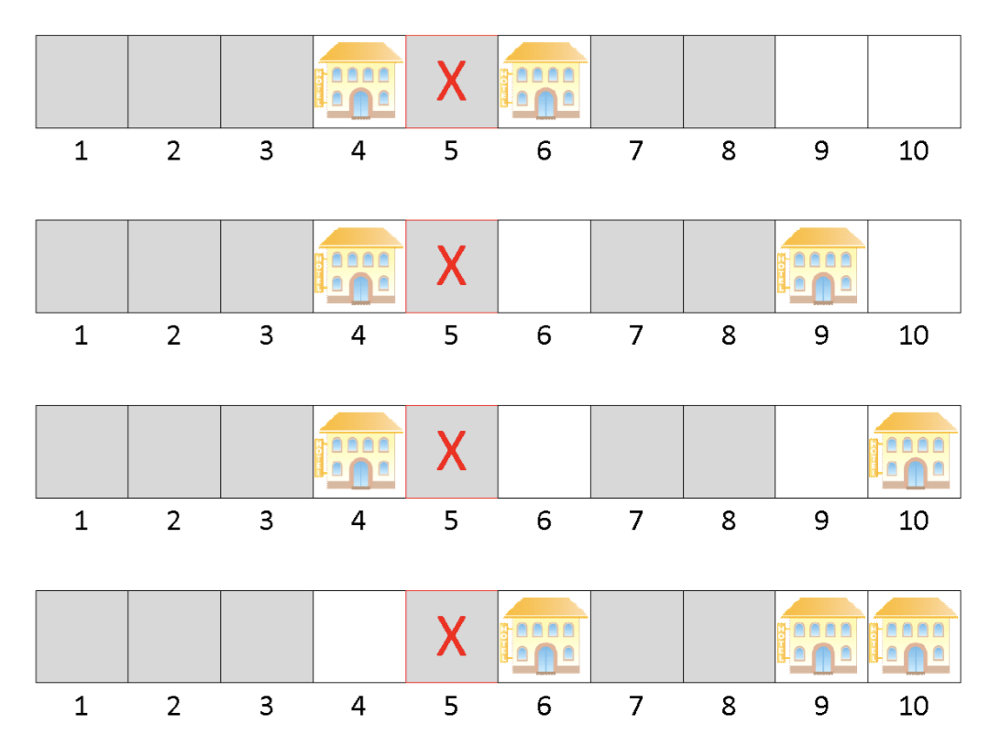

---
hide:
  - toc
---

# 2 - Hoteli

=== "Zadatak"
	
	| Vremensko ograničenje | Memorijsko ograničenje |
	|:-:|:-:|
	| 1000ms | 32MB |
	
	Tajvan, drevna ostrvska zemlja, nadaleko je poznata po nindžama, Acer-u i dugačkim i lepim plažama. Duž jedne od takvih plaža nalazi se $N$ odmarališta, numerisanih brojevima od $1$ do $N$, **redom**, s leva na desno. Rastojanje između dva uzastopna odmarališta je tačno $1$ km; specijalno, rastojanje između odmarališta broj $i$ i odmarališta broj $j$ je $|i-j|$ kilometara za svako $1\leq i,j\leq N$.
	
	Ovih dana, aktuelna je vest da sumnjivi ruski biznismeni iz Crne Gore planiraju da u nekim odmaralištima sagrade luksuzne hotele. Za svako odmaralište **je poznato da li je u njemu moguće sagraditi hotel ili ne** (ukoliko je moguće, nije nužno sagraditi hotel u njemu). Kada se hoteli budu sagradili, odrediće se **poredak odmarališta po popularnosti** na sledeći način: odmaralište $i$ će biti popularnije od odmarališta $j$ ako i samo ako je:
	
	* Rastojanje od odmarališta $i$ do njemu najbližeg hotela manje od rastojanja odmarališta $j$ do njemu najbližeg hotela; **ili**
	* prethodno pomenuta rastojanja su ista i važi $i<j$.
	
	Na primer, ukoliko imamo $8$ odmarališta i hoteli su sagrađeni u odmaralištima broj $2$, $6$ i $7$ tada je poredak odmarališta po popularnosti (počevši od najpopularnijeg): $2$, $6$, $7$, $1$, $3$, $5$, $8$, $4$. Na primer, odmaralište $6$ je popularnije od odmarališta $5$ jer je odmaralištu $6$ najbliži hotel na rastojanju $0$, dok je odmaralištu $5$ najbliži hotel na rastojanju $1$. Slično, odmaralište $3$ je popularnije od odmarališta $5$ jer su im najbliži hoteli podjednako udaljeni i važi $3<5$, itd.
	
	
	
	Međutim, stari naturalizovani tajvanac Stanoje Hvang poseduje odmaralište broj $X$, srećni broj $P$ i većinu ruskih biznismena pa, sasvim prirodno, **želi da se hoteli sagrade tako da odmaralište broj $X$ bude $P$-to po popularnosti**. Na koliko načina se to može uraditi?
	
	## Opisi funkcija
	Potrebno je da implementirate funkciju:
	
	* `BrojIzgradnji(N, X, P, H[])`;
	
	gde je $N$ – broj odmarališta, $X$ – redni broj odmarališta koje poseduje Stanoje, $P$ – Stanojev srećni broj i $H$ – niz dužine $N$ (indeksiran od $1$) koji označava u kojim odmaralištima se mogu sagraditi hoteli: ukoliko je $H_i=1$, u i-tom odmaralištu se može sagradati hotel; u suprotnom je $H_i=0$. Ova funkcija mora da vrati jedan ceo broj – broj načina na koji se mogu izgraditi hoteli tako da svi pomenuti uslovi budu zadovoljeni po modulu $1.000.000.007$ $(10^9+7)$.
	
	## Primer 1
	Neka je $N=10$, $X=5$, $P=4$ i $H=[0, 0, 0, 1, 0, 1, 0, 0, 1, 1]$. Tada postoji tačno $4$ načina da se izgrade hoteli tako da odmaralište broj $5$ bude $4$. po popularnosti i ti načini su:
	
	
	
	Prema tome, u ovom slučaju vaša funkcija mora da vrati $4 \text{ MOD } 1.000.000.007=4$.
	
	## Ograničenja
	
	* $1 \leq N \leq 300$.
	* $1 \leq X \leq N$.
	* $1 \leq P \leq N$.
	* Za svako $1 \leq i \leq N$ važi $H[i] \in \{0, 1\}$.
	
	Podzadaci:
	
	* PODZADATAK $1$ [$12$ POENA]: $N\leq 20$.
	* PODZADATAK $2$ [$13$ POENA]: $N\leq 25$, $X=1$ i $H[i]=1$ za svako $1\leq i \leq N$.
	* PODZADATAK $3$ [$18$ POENA]: $P=N$.
	* PODZADATAK $4$ [$21$ POENA]: $N\leq 100$.
	* PODZADATAK $5$ [$36$ POENA]: Nema dodatnih ograničenja.
	
	## Detalji implementacije
	Potrebno je da pošaljete tačno jedan fajl, pod nazivom `hoteli.c`, `hoteli.cpp` ili `hoteli.pas`, koji implementira gore pomenutu funkciju. Osim tražene funkcije, vaš fajl može sadržati i dodatne globalne promenljive, pomoćne funkcije i dodatne biblioteke.
	
	Zavisno od programskog jezika koji koristite, vaša funkcija/procedura mora biti sledećeg oblika:
	```
	C/C++:
	int BrojIzgradnji(int N, int X, int P, int* H);
	Pascal:
	function BrojIzgradnji(N, X, P : longint; H : array of longint) : longint;
	```
	
	## Testiranje i eksperimentisanje
	Uz zadatak, obezbeđeni su vam “template” fajlovi (`hoteli.c`, `hoteli.cpp`, `hoteli.pas`) koje možete koristiti i menjati po potrebi. Takođe su vam obezbeđeni programi (`grader.c`, `grader.cpp`, `grader.pas`) koji služe da lakše testirate kodove. Ovi programi učitavaju sa standardnog ulaza sledeće podatke:
	
	* U prvom redu brojeve $N$, $X$ i $P$, redom, razdvojene razmakom;
	* U drugom redu niz $H – N$ brojeva $H[i]$ razdvojenih razmakom;
	
	zatim pozivaju vašu funkciju `BrojIzgradnji` iz odgovarajućeg fajla (`hoteli.c`, `hoteli.cpp`, `hoteli.pas`) sa učitanim parametrima i na kraju vrednost koju vaša funkcija vraća ispisuju na standardni izlaz. Kodove ovih programa možete menjati po potrebi.
	

=== "Rešenje"
	
	| Autor | Tekst i test primeri | Analiza rеšenja | Testiranje |
	|:-:|:-:|:-:|:-:|
	| Nikola Milosavljević | Uglješa Stojanović | - | Nikola Milosavljević |
	
	
	``` cpp title="02_hoteli.cpp" linenums="1"
	#include "hoteli.h"
	#include <cstdio>
	#include <algorithm>
	#include <ctime>
	#define MOD 1000000007L
	using namespace std;
	
	int leftdp[310][310];
	int rightdp[310][310];
	
	int diagonalSum[310][310];
	int columnSum[310][310];
	
	int getDiagonalSum (int i, int j)
	{
	    if (i<0 || j<0) return 0;
	    return diagonalSum[i][j];
	}
	int getColumnSum(int i, int j)
	{
	     if (i<0 || j<0) return 0;
	    return columnSum[i][j];
	}
	int BrojIzgradnji(int n,int x, int p, int* H)
	{
	    int sol=0;
	    p--;
	    for (int k=0;x+k<n || x-k>0;k++)
	    {
	        int r = 2*k+1;
	
	        if (x-k+1>0 && k!=0) H[x-k]=0;
	        if (x+k-1<=n && k!=0)H[x+k-2]=0;
	
	        //solve left side
	        leftdp[0][0]=diagonalSum[0][0]=columnSum[0][0]=1;
	        for (int i=1;i<=x;i++)
	        {
	            for (int j=0;j<=i;j++)
	            {
	                if ( i-1-k < 0 || H[i-1-k]==0)leftdp[i][j]=0;
	                else
	                {
	                    leftdp[i][j] = getDiagonalSum(i-1,j-1)-getDiagonalSum(i-r,j-r);
	                    leftdp[i][j]=(leftdp[i][j]+MOD)%MOD;
	                    leftdp[i][j]+=getColumnSum(i-r,j-r);
	                    leftdp[i][j]%=MOD;
	                }
	                diagonalSum[i][j] = ((i>0 && j>0)?diagonalSum[i-1][j-1]:0) + leftdp[i][j];
	                diagonalSum[i][j]%=MOD;
	                columnSum[i][j] = columnSum[i-1][j] + leftdp[i][j];
	                columnSum[i][j]%=MOD;
	            }
	        }
	        //solve right side
	       r-=2;
	       rightdp[0][0]=diagonalSum[0][0]=columnSum[0][0]=1;
	       if (k!=0)
	       for (int i=1;n-i>=x;i++)
	       {
	            for (int j=0;j<=i;j++)
	            {
	                if (n-i+k-1>=n || H[n-i+k-1]==0)rightdp[i][j]=0;
	                else
	                {
	                    rightdp[i][j] = getDiagonalSum(i-1,j-1)-getDiagonalSum(i-r,j-r);
	                    rightdp[i][j]=(rightdp[i][j]+MOD)%MOD;
	                    rightdp[i][j]+=getColumnSum(i-r,j-r);
	                    rightdp[i][j]%=MOD;
	                }
	                diagonalSum[i][j] = ((i>0 && j>0)?diagonalSum[i-1][j-1]:0) + rightdp[i][j];
	                diagonalSum[i][j]%=MOD;
	                columnSum[i][j] = columnSum[i-1][j] + rightdp[i][j];
	                columnSum[i][j]%=MOD;
	            }
	        }
	        //sum the solution
	        if (k==0)
	        {
	            long long solI = leftdp[x][p+1];
	            solI%=MOD;
	            for (int i=x;i<n;i++)
	            {
	                if (H[i]==1)
	                {
	                    solI*=2;
	                    solI%=MOD;
	                }
	            }
	            sol+=solI;
	            sol%=MOD;
	        }
	        else
	        {
	            for (int i=0;i<=p;i++)
	            {
	                long long leftLastTaken = 0;
	                long long leftLastNotTaken = 1;
	                if (i!=0)
	                {
	                    leftLastTaken =i+1<=x?leftdp[x][i+1]:0;
	                    leftLastNotTaken = 0;
	                    for (int j=1;j<x;j++)
	                    {
	                        leftLastNotTaken += leftdp[j][i];
	                        leftLastNotTaken%=MOD;
	                    }
	                }
	                long long rightLastTaken = 0;
	                long long rightLastNotTaken = 1;
	                if (i!=p)
	                {
	                    rightLastTaken = rightdp[n-x][p-i];
	                    rightLastNotTaken = 0;
	                    for (int j=1;j<n-x;j++)
	                    {
	                        rightLastNotTaken+=rightdp[j][p-i];
	                        rightLastNotTaken%=MOD;
	                    }
	                }
	                long long solForI = (leftLastTaken * rightLastNotTaken )%MOD;
	                solForI+=(leftLastTaken*rightLastTaken)%MOD;
	                solForI%=MOD;
	                solForI+=(leftLastNotTaken*rightLastTaken)%MOD;
	                solForI%=MOD;
	                sol+=solForI;
	                sol%=MOD;
	            }
	        }
	    }
	    return sol;
	}
	

	```
