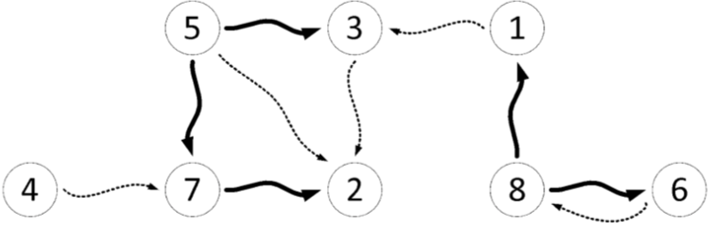

---
hide:
  - toc
---

# 3 - Čaj

=== "Zadatak"
	
	| Vremensko ograničenje | Memorijsko ograničenje |
	|:-:|:-:|
	| 1000ms | 128MB |
	
	U tajvanskom urbanom gradu Tajpeiju, nalazi se $N$ drevnih čajdžinica numerisanih brojevima od $1$ do $N$. Vlasnici ovih čajdžinica su sagradili i $M$ **jednosmernih** tajnih prolaza – svaki tajni prolaz spaja neke dve čajdžinice a u njemu su stražari koji propuštaju posetioce (sumnjive tajvanske tajkune) samo u odgovarajućem smeru.
	
	Jedan od najsumnjivijih tajvanskih tajkuna je naturalizovani tajvanac Zvonko Lim koji osobito voli da se napije pirinčanog vina a zatim da posećuje pomenute tajvanske čajdžinice. On ima listu tih $N$ čajdžinica **u redosledu  od najomiljenije do najmanje omiljene** (na prvoj poziciji je najomiljenija). Vlasnici čajdžinica ne znaju njegovu listu ali će pokušati da je rekonstruišu na osnovu poznavanja Zvonkovih navika prilikom obilaska čajdžinica. Naime, kada se Zvonko napije pirinčanog vina, on umisli da je DFS i posećuje čajdžinice na sledeći način:
	
	1. Na početku se spusti helikopterom u prvu čajdžinicu sa svoje liste.
	2. Ako se trenutno nalazi u čajdžinici broj $X$, tada posmatra skup svih čajdžinica do kojih može doći nekim tajnim prolazom iz čajdžinice $X$ **a koje već nije obišao**:
	* Ukoliko je taj skup neprazan, on od svih čajdžinica iz tog skupa bira **najomiljeniju (na osnovu liste)**, ide tajnim prolazom do nje **usput podmićujući stražare** i, kada stigne, **ponavlja korak $2$**.
	* Ukoliko je taj skup prazan, on se vraća iz čajdžinice $X$ onim tajnim prolazom kojim je došao do $X$ (iako je taj prolaz u suprotnom smeru on je već podmitio stražare dolazeći u $X$ pa mu oni dozvoljavaju da prođe) i **ponavlja korak $2$**. Međutim, ukoliko je u $X$ došao helikopterom a ne tajnim prolazom, on odlazi helikopterom u najomiljeniju čajdžinicu koju do tada nije posetio i **ponavlja korak $2$**.
	
	Kada obiđe **sve** čajdžinice na ovaj način, Zvonko Lim odlazi kući da spava
	
	Vlasnici čajdžinica ne znaju u kom redosledu je Zvonko obilazio čajdžinice ali poznaju strukturu tajnih prolaza i otkrili su **sve podmićene stražare**. Pomozite im da otkriju **kako izgleda Zvonkova lista**! Uz to, ako postoji više rešenja, čajdžinica *broj $1$* će vas častiti dodatnim poenima ako je stavite što bliže početku liste.
	
	## Opisi funkcija
	Potrebno je da implementirate funkciju:
	
	* `OdrediListu(N, M, c1[], c2[], g[], L[])`
	
	gde je $N$ – broj čajdžinica, $M$ broj tajnih prolaza a $c1$, $c2$ i $g$ nizovi dužine $M$ koji opisuju tajne prolaze: za svako $1 \leq i\leq M$, $i$-ti tajni prolaz vodi od čajdžinice broj $c1[i]$ do čajdžinice broj $c2[i]$ i, ukoliko je $g[i]=0$, stražari u tom tajnom prolazu nisu bili podmićeni (tj. Zvonko se tuda nije kretao) a ukoliko je $g[i]=1$, stražari u tom tajnom prolazu su bili podmićeni (tj. tuda se Zvonko kretao). Niz $L$ dužine $N$ predstavlja Zvonkovu listu koju **vi trebate da “popunite”** (na prvom mestu staviti indeks njegove najomiljenije čajdžinice i tako redom do najmanje omiljene). **Svi nizovi su indeksirani od $1$**.
	
	## Primer 1
	Neka je $N=8$, $M=10$, $c1=[4, 5, 1, 8, 8, 6, 7, 5, 3, 5]$, $c2=[7, 7, 3, 6, 1, 8, 2, 3, 2, 2]$ i $g=[0, 1, 0, 1, 1, 0, 1, 1, 0, 0]$. Tada imamo $5$ tajnih prolaza u kojima su podmićeni stražari (tj. kojim je Zvonko prolazio) – **oni su označeni zadebljanim strelicama na slici**. U ovoj situaciji, jedna od mogućih Zvonkovih listi omiljenih čajdžinica je $L=[5, 8, 7, 6, 4, 1, 3, 2]$. Zaista, tada bi Zvonkovo kretanje izgledalo ovako: Na početku se helikopterom spusti u njemu najomiljeniju čajdžinicu $(5)$; Iz ove čajdžinice on može doći do čajdžinica $2$, $3$ ili $7$.
	
	Kako mu je od njih $7$ najomiljenija, od ide do nje i podmićuje stražare u prolazu $5\rightarrow 7$. Zatim iz $7$ odlazi do $2$ (nadalje se podmićivanje podrazumeva). Sada nema gde, pa se vraća odakle je došao (u čajdžinicu $7$, ovog puta u suprotnom smeru). Sada takođe nema gde iz $7$ pa se vraća u $5$. Iz čajdžinice broj $5$ ide u $3$ jer je to njegova najomiljenija čajdžinica do koje može doći iz $5$ a da je već nije posetio. Sada iz $3$ nema gde pa se vraća u $5$. Sada iz $5$ nema gde a kako je u čajdžinicu broj $5$ došao helikopetrom a ne tajnim prolazom, onda uzima helikopter i sleće u sledeću najominjeniju čajdžinicu koju do sada nije posetio – broj $8$. Zatim ide u $6$ (omiljenija mu je od $1$), zatim se istim prolazom (a ne prolazom $6\rightarrow 8$) vraća u $8$, pa zatim ide u $1$ pa ponovo nazad u $8$ odakle helikopterom odlazi u $4$. Iz $4$ nema prolaza koji vode do neobiđene čajdžinice a ovo je ujedno poslednja obiđena čajdžinica pa Zvonko odlazi da spava.
	
	Pomenuta Zvonkova lista nije najoptimalnija – čajdžinica $1$ može biti bolje plasirana od $6$ mesta na listi. Lista $L=[5, 8, 1, 7, 6, 4, 3, 2]$ je jedna od najoptimalnijih – u njoj je čajdžinica $1$ na poziciji $3$ (bolje od ovoga ne može). Takođe primetimo da npr. lista $L=[5, 8, 2, 7, 6, 4, 1, 3]$ nije korektna: posle spuštanja helikopterom u $5$, Zvonko bi otišao u čajdžinicu broj $2$ prolazom $5\rightarrow 2$, a znamo da tu nije podmićivao stražare, tj. da nije prolazio tuda.
	
	
	
	## Ograničenja
	
	* $2\leq N\leq 100.000$.
	* $1\leq M\leq 300.000$.
	* Za svako $1\leq i\leq M$ važi $1\leq c1[i], c2[i]\leq N$, $c1[i]\neq c2[i]$ i $g[i]\in\{0,1\}$.
	* Između svake dve čajdžinice postoji **najviše jedan tajni prolaz u jednom smeru**.
	* **Garantuje se da rešenje, ne nužno jedinstveno, uvek postoji.**
	
	U svakom podzadatku, ukoliko vaš program vrati bilo koju korektnu Zvonkovu listu (u svim test primerima) dobijate $70\%$ **poena** od odgovarajućeg podzadatka. Ukoliko je u svakom test primeru podzadatka čajdžinica $1$ najbliže moguće početku liste (a lista je i dalje korektna) dobijate svih $100\%$ poena tog podzadatka.
	
	* PODZADATAK $1$ [$11$ POENA]: $N\leq 8$ i $M\leq 20$.
	* PODZADATAK $2$ [$9$ POENA]: Ima tačno $N-1$ tajnih prolaza u kojima su podmićeni stražari i oni obrazuju put dužine $N-1$.
	* PODZADATAK $3$ [$9$ POENA]: Nema podmićenih stražara, tj. Zvonko Lim je uvek koristio helikopter.
	* PODZADATAK $4$ [$17$ POENA]: $N\leq 500$ i $M\leq 10.000$.
	* PODZADATAK $5$ [$21$ POENA]: $N\leq 2.000$.
	* PODZADATAK $6$ [$33$ POENA]: Nema dodatnih ograničenja.
	
	## Detalji implementacije
	Potrebno je da pošaljete tačno jedan fajl, pod nazivom `caj.c`, `caj.cpp` ili `caj.pas`, koji implementira gore pomenutu funkciju. Osim tražene funkcije, vaš fajl može sadržati i dodatne globalne promenljive, pomoćne funkcije i dodatne biblioteke.
	
	Zavisno od programskog jezika koji koristite, vaša funkcija/procedura mora biti sledećeg oblika:
	```
	C/C++:
	void OdrediListu(int N, int M, int* c1, int* c2, int* g, int* L);
	Pascal:
	procedure OdrediListu(N, M : longint; var c1, c2, g, L : array of longint);
	```
	
	Parametri funkcije/procedure su ranije opisani; $N$, $M$ i nizovi $c1$, $c2$, $g$ su ulazni parametri dok je niz $L$ izlazni parametar.
	
	## Testiranje i eksperimentisanje
	Uz zadatak, obezbeđeni su vam “template” fajlovi (`caj.c`, `caj.cpp`, `caj.pas`) koje možete koristiti i menjati po potrebi. Takođe su vam obezbeđeni programi (`grader.c`, `grader.cpp`, `grader.pas`) koji služe da lakše testirate kodove. Ovi programi učitavaju sa standardnog ulaza sledeće podatke:
	
	* U prvom redu brojeve $N$ i $M$, razdvojene razmakom;
	* U sledećih $M$ redova brojeve $c1[i]$, $c2[i]$, $g[i]$ razdvojene razmakom;
	
	zatim pozivaju vašu funkciju `OdrediListu` iz odgovarajućeg fajla (`caj.c`, `caj.cpp` ili `caj.pas`) sa učitanim parametrima i na kraju vrednosti niza `L` ispisuju na standardni izlaz – `N` brojeva razdvojenih razmakom u jednom redu. Kodove ovih programa možete menjati po potrebi.
	

=== "Rešenje"
	
	| Autor | Tekst i test primeri | Analiza rеšenja | Testiranje |
	|:-:|:-:|:-:|:-:|
	| Nikola Milosavljević | Nikola Milosavljević | - | Demjan Grubić |
	
	
	``` cpp title="03_caj.cpp" linenums="1"
	#include "caj.h"
	
	#include <cstdlib>
	#include <memory.h>
	#include <vector>
	
	using namespace std;
	
	const int MaxN = 100100;
	const int LogMaxN = 18;
	const int MaxM = 200200;
	
	vector<int> adjT[MaxN];  // lista suseda racunajuci samo tree-edges
	vector<int> ADJ[MaxN];   // lista suseda u grafu koji pravimo od datog: u->v ako u mora pre v
	vector<int> ADJ_REV[MaxN];
	int inDeg[MaxN];
	int currRoot;
	int time;
	int dfsIn[MaxN], dfsOut[MaxN];
	int level[MaxN], parent[MaxN];
	int P[MaxN][LogMaxN];
	
	void DFS(int u)
	{
		dfsIn[u] = ++time;
	
		if (u != 0)
		{
			if (inDeg[u] == 0)
				currRoot = u;
			else
				ADJ[currRoot].push_back(u); // Koren svakog DFS stabla mora biti pre sve svoje dece u listi
		}
	
		for (int i = 0; i < (int)adjT[u].size(); i++)
		{
			int v = adjT[u][i];
			parent[v] = u;
			level[v] = level[u] + 1;
			DFS(v);
		}
	
		dfsOut[u] = ++time;
	}
	
	int kthAnc(int u, int k)
	{
		int i = 0;
		while (k > 0)
		{
			if ((k & 1) != 0)
				u = P[u][i];
			i++;
			k = k >> 1;
		}
	
		return u;
	}
	
	int lca(int u, int v)
	{
	    if (level[u] < level[v])
		{
	          int tmp = u; u = v; v = tmp;
		}
	
		int log = 1;
		while ((1 << log) <= level[u]) 
			log++;
		log--;
		
	    for (int i = log; i >= 0; i--)
		{
			if ((1 << i) <= level[u] - level[v])
	              u = P[u][i];
		}
	
		if (u == v)
			return u;
		
	    for (int i = log; i >= 0; i--)
	          if (P[u][i] != -1 && P[v][i] != -1 && P[u][i] != P[v][i])
			  {
	              u = P[u][i];
				  v = P[v][i];
			  }
		
	    return parent[u];
	}
	
	void TopSort(int N, int* L)
	{
		memset(inDeg, 0, sizeof(inDeg));
		for (int u = 1; u <= N; u++)
		{
			for (int i = 0; i < (int)ADJ[u].size(); i++)
			{
				int v = ADJ[u][i];
				ADJ_REV[v].push_back(u);
				inDeg[u]++;
			}
		}
	
		int first = 0, last = 0;
	
		for (int u = 2; u <= N; u++)  // od 2
			if (inDeg[u] == 0)
				L[++last] = u;
	
		if (last == 0)
		{
			L[++last] = 1;
			if (inDeg[1] != 0) { printf("FAIL\n"); return; }
		}
	
		while (first < last)
		{
			first++;
			int u = L[first];
	
			for (int i = 0; i < (int)ADJ_REV[u].size(); i++)
			{
				int v = ADJ_REV[u][i];
				inDeg[v]--;
				if (inDeg[v] == 0 && v != 1)
					L[++last] = v;
			}
	
			if (first == last && last != N)
			{
				L[++last] = 1;
				if (inDeg[1] != 0) { printf("FAIL\n"); return; }
			}
		}
	
		if (last != N) { printf("FAIL\n"); return; }
	
		for (int i = 1; i <= N / 2; i++)
		{
			int tmp = L[i]; L[i] = L[N - i + 1]; L[N - i + 1] = tmp;
		}
	}
	
	void OdrediListu(int N, int M, int* c1, int* c2, int* g, int* L)
	{
		memset(inDeg, 0, sizeof(inDeg));
		for (int i = 1; i <= M; i++)
		{
			if (g[i] == 1)
			{
				adjT[ c1[i] ].push_back(c2[i]);
				inDeg[ c2[i] ]++;
			}
		}
	
		for (int i = 1; i <= N; i++)
		{
			if (inDeg[i] == 0)
				adjT[0].push_back(i);
		}
	
		level[0] = 0;
		parent[0] = -1;
		time = 0;
		DFS(0);
	
		// racunamo tablicu za LCA
		for (int i = 0; i <= N; i++)
			P[i][0] = parent[i];
	
		for (int j = 1; (1 << j) <= N; j++) 
			for (int i = 0; i <= N; i++)
				if (P[i][j - 1] != -1)
					P[i][j] = P[ P[i][j - 1] ][j - 1];
				else
					P[i][j] = -1;
	
		// na osnovu "cross" i "forward" edges dodajemo jos grana u novom grafu
		for (int i = 1; i <= M; i++)
		{
			if (g[i] == 0)
			{
				int u = c1[i], v = c2[i];
	
				if (dfsIn[u] < dfsIn[v] && dfsOut[v] < dfsOut[u]) // forward edge
				{
					int v1 = kthAnc(v, level[v] - level[u] - 1);
					ADJ[v1].push_back(v);
				}
	
				if (dfsOut[u] < dfsIn[v] || dfsOut[v] < dfsIn[u]) // cross edge
				{
					int x = lca(u, v);
					int u1 = kthAnc(u, level[u] - level[x] - 1);
					int v1 = kthAnc(v, level[v] - level[x] - 1);
					ADJ[v1].push_back(u1);
				}
			}
		}
	
		TopSort(N, L);
	}

	```
