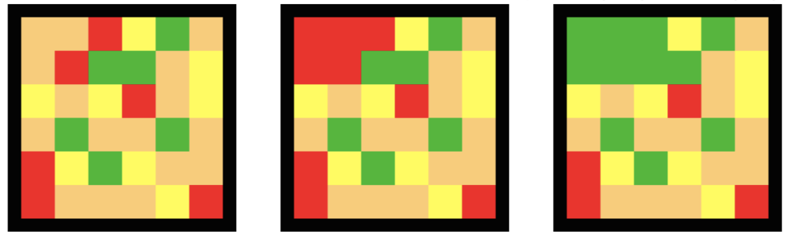

Мали Перица је захваљујући вашој помоћи у претходним фазама такмичења однео победу на ИОФБ (Међународној Flappy Bird олимпијади). Сада је пронашао нову игрицу – ”Поплаву”. Правила игре су једноставна – на почетку је дата табла попуњена неким бојама, и сва поља која су суседна и попуњена истим бојама припадају једном скупу поља. Два поља табле су суседна уколико имају заједничку ивицу. У једном потезу, Перица има право да промени боју горњег левог скупа (скупа који садржи горње лево поље); уколико скуп има неки суседан скуп те боје, они се спајају. Игра се завршава када је цела табла прекривена истом бојом, тј. кад на табли постоји само један скуп.

Да би могао да се пласира на ИОП (Међународну олимпијаду у ”Поплави”) у Тајвану, Перица мора да савлада комисијске табле у што мање потеза. Успео је да провали у базу података и сазна све табле које комисија може да му постави; помозите му тако што ћете направити програм који одређује потезе које Перица треба да одигра. На сликама доле се налазе три стања табле: почетно стање, стање након што Перица одигра црвену боју, па зелену боју.   

## Opisi funkcija
Потребно је имплементирати функцију:

* `ResiTablu(N, M, C, T[], P[]);`

ова функција се позива само једном на почетку програма и означава да треба решавати табелу која има $N$ редова, $M$ колона и $C$ различитих боја означених од $0$ до $C-1$. У низу $T$ величине $N\cdot M$ налази се сама табела коју треба решавати, тако да првих $M$ поља представљају боје колона првог реда, следећих $M$ поља боје колона другог реда, итд.

Низ $P$ представља низ потеза који желите да предложите Перици да изврши; **овај низ ви требате да ”попуните”** (на првом месту ставите боју првог потеза, и тако даље све док цела табла не буде решена). **Сви низови су индексирани од $1$.** Ваша функција мора да као повратну вредност врати дужину низа $P$, тј. укупан број потеза.

## Primer 1
Претпоставимо да је ваш програм добио наредбу да изврши: `ResiTablu(2, 2, 3, [1, 0, 1, 2], P)`.

Једно од могућих решења је: $P= [0, 2]$; повратна вредност функције је $2$.

Стања табле на почетку и после сваког потеза су:

$$
(1 0 1 2) \rightarrow (0 0 0 2) \rightarrow (2 2 2 2)
$$

## Ograničenja

* $1\leq N,M,C\leq 100$.
* $0\leq Ti < C$.
* Ваш програм не сме да направи више од $10000$ потеза.

У формули која следи, $|P|$ је повратна вредност ваше функције `ResiTablu`. Задатак се састоји од $20$ тест примера.  За сваки коректно решени тест пример, добијате:

* $5$ поена уколико је $|P| \leq A$;
* $0.05$ поенa уколико $|P| \geq B$;
* $5\cdot \frac{A\cdot(B-|P|)}{|P|\cdot(B-A)}$ поена иначе.

$A$ и $B$ су константе које зависе од тест примера:

* У $25\%$ тест примера важи $N=M=C=6$; $A=11$, $B=30$.
* У $25\%$ тест примера важи $N=M=26$,  $C=8$; $A=55$, $B=110$.
* У $25\%$ тест примера важи $N=M=100$,  $C=6$; $A=140$, $B=250$.
* У $25\%$ тест примера важи $N=M=C=100$; $A=1100$, $B=1400$.