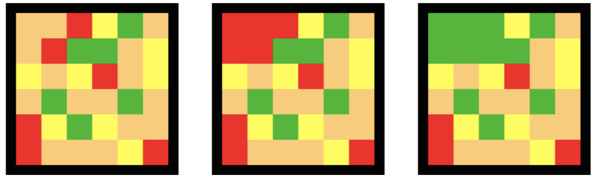

---
hide:
  - toc
---

# 5 - Poplava

=== "Zadatak"
	
	| Vremensko ograničenje | Memorijsko ograničenje |
	|:-:|:-:|
	| 3000ms | 64MB |
	
	Mali Perica je zahvaljujući vašoj pomoći u prethodnim fazama takmičenja odneo pobedu na IOFB (Međunarodnoj Flappy Bird olimpijadi). Sada je pronašao novu igricu – ”Poplavu”. Pravila igre su jednostavna – na početku je data tabla popunjena nekim bojama, i sva polja koja su susedna i popunjena istim bojama pripadaju jednom skupu polja. Dva polja table su susedna ukoliko imaju zajedničku ivicu. U jednom potezu, Perica ima pravo da promeni boju gornjeg levog skupa (skupa koji sadrži gornje levo polje); ukoliko skup ima neki susedan skup te boje, oni se spajaju. Igra se završava kada je cela tabla prekrivena istom bojom, tj. kad na tabli postoji samo jedan skup.
	
	Da bi mogao da se plasira na IOP (Međunarodnu olimpijadu u ”Poplavi”) u Tajvanu, Perica mora da savlada komisijske table u što manje poteza. Uspeo je da provali u bazu podataka i sazna sve table koje komisija može da mu postavi; pomozite mu tako što ćete napraviti program koji određuje poteze koje Perica treba da odigra. Na slikama dole se nalaze tri stanja table: početno stanje, stanje nakon što Perica odigra crvenu boju, pa zelenu boju.
	
	
	
	## Opisi funkcija
	Potrebno je implementirati funkciju:
	
	* `ResiTablu(N, M, C, T[], P[]);`
	
	ova funkcija se poziva samo jednom na početku programa i označava da treba rešavati tabelu koja ima $N$ redova, $M$ kolona i $C$ različitih boja označenih od $0$ do $C-1$. U nizu $T$ veličine $N\cdot M$ nalazi se sama tabela koju treba rešavati, tako da prvih $M$ polja predstavljaju boje kolona prvog reda, sledećih $M$ polja boje kolona drugog reda, itd.
	
	Niz $P$ predstavlja niz poteza koji želite da predložite Perici da izvrši; **ovaj niz vi trebate da ”popunite”** (na prvom mestu stavite boju prvog poteza, i tako dalje sve dok cela tabla ne bude rešena). **Svi nizovi su indeksirani od $1$.** Vaša funkcija mora da kao povratnu vrednost vrati dužinu niza $P$, tj. ukupan broj poteza.
	
	## Primer 1
	Pretpostavimo da je vaš program dobio naredbu da izvrši: `ResiTablu(2, 2, 3, [1, 0, 1, 2], P)`.
	
	Jedno od mogućih rešenja je: $P= [0, 2]$; povratna vrednost funkcije je $2$.
	
	Stanja table na početku i posle svakog poteza su:
	
	$$
	(1 0 1 2) \rightarrow (0 0 0 2) \rightarrow (2 2 2 2)
	$$
	
	## Ograničenja
	
	* $1\leq N,M,C\leq 100$.
	* $0\leq Ti < C$.
	* Vaš program ne sme da napravi više od $10000$ poteza.
	
	U formuli koja sledi, $|P|$ je povratna vrednost vaše funkcije `ResiTablu`. Zadatak se sastoji od $20$ test primera.  Za svaki korektno rešeni test primer, dobijate:
	
	* $5$ poena ukoliko je $|P| \leq A$;
	* $0.05$ poena ukoliko $|P| \geq B$;
	* $5\cdot \frac{A\cdot(B-|P|)}{|P|\cdot(B-A)}$ poena inače.
	
	$A$ i $B$ su konstante koje zavise od test primera:
	
	* U $25\%$ test primera važi $N=M=C=6$; $A=11$, $B=30$.
	* U $25\%$ test primera važi $N=M=26$,  $C=8$; $A=55$, $B=110$.
	* U $25\%$ test primera važi $N=M=100$,  $C=6$; $A=140$, $B=250$.
	* U $25\%$ test primera važi $N=M=C=100$; $A=1100$, $B=1400$.
	

=== "Rešenje"
	
	| Autor | Tekst i test primeri | Analiza rеšenja | Testiranje |
	|:-:|:-:|:-:|:-:|
	| Dušan Zdravković | Petar Veličković | - | Marko Savić |
	
	
	``` cpp title="05_poplava.cpp" linenums="1"
	// Nažalost nemamo ovo rešenje.
	```
