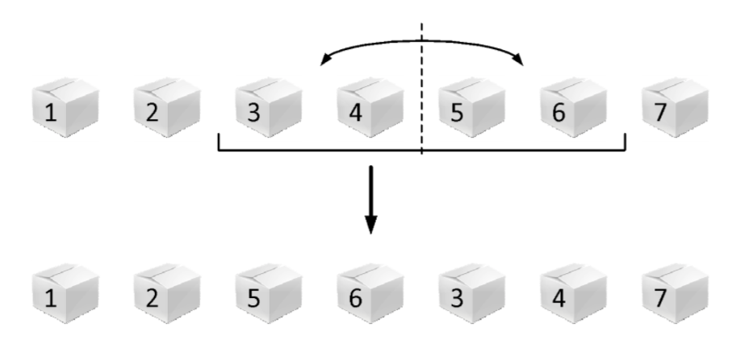

Млади тајванац Тео Лин се спрема да дочека такмичаре, професоре и госте који ће доћи ове године на IOI. Као добар домаћин, он ће сваком такмичару поклонити по кутију пиринча када стигне. Како је познато да ће доћи $N$ људи, он је већ спремио $N$ (празних) кутија и поставио их у низ, једну до друге.

Сваког дана када се врати са свог поља, он изабере неких узастопних $2^k$ кутија, а затим у сваку убаци $2^v$ зрнца пиринча (Тео Лин много воли "округле" бројеве, тј. степене двојке).

Некад, када му је досадно, он мало измеша кутије. То ради тако што изабере групу од $2^k$ узастопних кутија, а затим замени њихов редослед тако сто узме првих пола $(2^{k-1})$ кутија из те групе, и стави их на место других пола кутија, и обрнуто. Другим речима, уколико имамо $7$ кутија, редом обележене бројевима $[1,2,3,4,5,6,7]$, а онда Тео изабере групу од $2^2$ кутије: $[3,4,5,6]$, редослед кутија након мешања ће бити: $[1,2,5,6,3,4,7]$. Овај поступак је приказан и на слици:



Пре него што убацује пиринач у кутије, Теа занима колико заправо тренутно има укупно пиринча у изабраних $2^k$ кутија. Због превише мешања, он је и заборавио где их је колико убацивао, а како нема времена да изброји, замолио је вас да му помогнете, и одговорите на нека питања које вас буде питао - Колико има укупно зрнаца пиринча у $2^k$ узастопних кутија које је изабрао.

## Opisi funkcija
Потребно је да имплементирате следеће $4$ функције:

* `Init(N,  subtask)` – ова функција се позива само једном на почетку програма и означава да има тачно $N$ кутија, и да је тај тест пример из подзадатка $subtask$. Можете је искористити да поставите почетне вредности својих глобалних променљивих/низова.
* `Ubaci(pos,  k,  v)` – oва функција означава да се у $2^k$ узастопних кутија, почевши од позиције $pos$ убацује $2^v$ зрнца пиринча. Ова функција се позива више пута у току програма са потенцијално различитим параметрима.
* `Izmesaj(pos,  k)` – ова функција означава да ће Тео Лин измешати $2^k$ узастопних кутија, почевши од позиције $pos$ као што је описано у задатку. Ова функција се позива више пута у току програма са потенцијално различитим параметрима.
* `Prebroji(pos,  k)` – ова функција представља питање “Колико има укупно зрнаца пиринча у $2^k$ узастопних кутија, почевши од позиције $pos$”; потребно је одговорити на питање, тј. Одговор вратити као вредност функције. Ова функција се позива више пута у току програма са потенцијално различитим параметрима.

**Позиције кутија су индексиране од $1$.**

## Primer 1
У следећој listi је приказан могући редослед позива ваших функција:

* `Init(10, 1)` - Добијате информацију (само једном на почетку) да је Тео припремио $10$ кутија, и да тест пример испуњава ограничења из првог подзадатка. На почетку је број зрнаца пиринча по кутијама: $[0,0,0,0,0,0,0,0,0,0]$.
* `Ubaci(3, 2, 5)` - Додајемо по $32$ ($2^5$) зрнца пиринча у $4$ ($2^2$) кутије почев од позиције $3$. Број зрнаца пиринча по кутијама је сада: $[0,0,32,32,32,32,0,0,0,0]$.
* `Ubaci(6, 1, 7)` - Додајемо по $128$ ($2^7$) зрнца пиринча у $2$ ($2^1$) кутије почев од позиције $6$. Број зрнаца пиринча по кутијама је сада: $[0,0,32,32,32,160,128,0,0,0]$.
* `Prebroji(5, 2)` - Потребно је вратити $320$ $(32 + 160 + 128 + 0)$, јер толико зрнаца има укупно у $4$ ($2^2$) кутије почев од позиције $5$. 
* `Izmesaj(4, 2)` - Измешамо $4$ кутије, које почињу од позиције $4$. Број зрнаца пиринча по кутијама је сада: $[0,0,32,160,128,32,32,0,0,0]$.
* `Prebroji(5, 2)` - Потребно је вратити $192$ $(128 + 32 + 32 + 0)$, јер толико зрнаца има укупно у $4$ ($2^2$) кутије почев од позиције $5$.
* `Izmesaj(1, 3)` - Измешамо $8$ кутије, које почињу од позиције $1$. Број зрнаца пиринча по кутијама је сада: $[128,32,32,0, 0,0,32,160,0,0]$
* `Prebroji(4, 2)` - Потребно је вратити $32$ $(0 + 0 + 0 + 32)$, јер толико зрнаца има укупно у $4$ ($2^2$) кутије почев од позиције $4$.
* `Prebroji(3, 3)` - Потребно је вратити $224$ $(32 + 0 + 0 + 0 + 32 + 160 + 0 + 0)$, јер толико зрнаца има укупно у $8$ ($2^3$) кутије почев од позиције $3$.

## Ograničenja

* Функција `Init(N,  subtask)` се позива тачно једном (на почетку) и важи $1\leq N\leq 100.000$ и $1\leq subtask\leq 5$.
* Функције `Ubaci`, `Izmesaj` и `Prebroji` се укупно позивају не више од $300.000$ пута.
* Приликом сваког позива `Ubaci(pos, k,  v)` важи $k\geq 0$, $1\leq pos\leq pos+2^k-1\leq N$, и $0\leq v\leq 30$.
* Приликом сваког позива `Izmesaj(pos,  k)` важи $k\leq1$, $1\leq pos\leq pos+2^k-1\leq N$.
* Приликом сваког позива `Prebroji(pos,  k)` важи $k\geq 0$, $1\leq pos\leq pos+2^k-1\leq N$.

Означимо са $numUbaci$ број позива функције `Ubaci`, са $numIzmesaj$ број позива функције `Izmesaj`, са $numPrebroji$ број позива функције `Prebroji`, и са $Q = numUbaci+numIzmesaj+numPrebroji$:

* ПОДЗАДАТАК $1$ [$7$ ПОЕНА]: $N\leq 1024$, $Q\leq 1024$.
* ПОДЗАДАТАК $2$ [$17$ ПОЕНА]: Приликом сваког позива функције `Ubaci` ће важити $k=0$ и приликом сваког позива функције `Izmesaj` ће важити $k=1$.
* ПОДЗАДАТАК $3$ [$18$ ПОЕНА]: $numIzmesaj=0$.
* ПОДЗАДАТАК $4$ [$25$ ПОЕНА]: $N\leq 16384$.
* ПОДЗАДАТАК $5$ [$33$ ПОЕНА]: Нема додатних ограничења.

## Detalji implementacije
Потребно је да пошаљете тачно један фајл, под називом `pirinac.c`, `pirinac.cpp` или `pirinac.pas`, који имплементира горе поменуту функцију. Осим тражене функције, ваш фајл може садржати и додатне глобалне променљиве, помоћне функције и додатне библиотеке.

Зависно од програмског језика који користите, ваша функција/процедура мора бити следећег облика:
```
C/C++:
    void Init(int N, int subtask);
    void Ubaci(int pos, int k, int v);
    void Izmesaj(int pos, int k);
    long long Prebroji(int pos, int k);
Pascal:
    procedure Init(N, subtask : longint);
    procedure Ubaci (pos, k, v : longint);
    procedure Izmesaj (pos, k : longint);
    function Prebroji(pos, k : longint) : int64;
```

## Testiranje i eksperimentisanje
Уз задатак, обезбеђени су вам “template” фајлови (`pirinac.c`, `pirinac.cpp`, `pirinac.pas`) које можете користити и мењати по потреби. Такође су вам обезбеђени програми (`grader.c`, `grader.cpp`, `grader.pas`) који служе да лакше тестирате кодове. Ови програми учитавају са стандардног улаза следеће податке:

* У првом реду бројеве $N$ и $Q$ и $subtask$, раздвојене размаком; $N$ је број кутија, $Q$ укупни број упита (не рачунајући `Init`), а subtask је редни број подзадатка;
* У наредних $Q$ редова налази се прво број $t$; уколико је $t = 1$, тада тренутни ред представља упит `Ubaci` и у наставку реда се учитавају још $3$ броја ($pos$, $k$, $v$) са којима се позива функција; уколико је $t = 2$, тада тренутни ред представља упит `Izmesaj` и у наставку реда се учитавају још $2$ броја ($pos$, $k$) са којима се позива функција; уколико $t = 3$, тада тренутни ред представља упит `Prebroji` и у наставку реда се учитавају још $2$ броја ($pos$, $k$) са којима се позива функција.

На почетку се позива ваша функција `Init` са параметрима $N$, $subtask$, a затим се за сваки учитани упит позива ваша одговарајућа функција из одговарајућег фајла (`pirinac.c`, `pirinac.cpp`, `pirinac.pas`) са учитаним параметрима. После сваког позива вашој функцији `Prebroji`, резултат који она враћа се исписује на стандардни излаз. Kодове ових програма можете мењати по потреби.