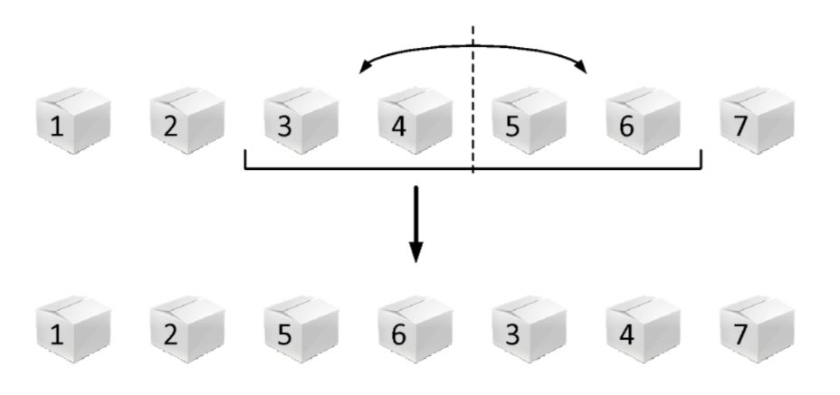

---
hide:
  - toc
---

# 6 - Pirinač

=== "Zadatak"
	
	| Vremensko ograničenje | Memorijsko ograničenje |
	|:-:|:-:|
	| 1000ms | 64MB |
	
	Mladi tajvanac Teo Lin se sprema da dočeka takmičare, profesore i goste koji će doći ove godine na IOI. Kao dobar domaćin, on će svakom takmičaru pokloniti po kutiju pirinča kada stigne. Kako je poznato da će doći $N$ ljudi, on je već spremio $N$ (praznih) kutija i postavio ih u niz, jednu do druge.
	
	Svakog dana kada se vrati sa svog polja, on izabere nekih uzastopnih $2^k$ kutija, a zatim u svaku ubaci $2^v$ zrnca pirinča (Teo Lin mnogo voli "okrugle" brojeve, tj. stepene dvojke).
	
	Nekad, kada mu je dosadno, on malo izmeša kutije. To radi tako što izabere grupu od $2^k$ uzastopnih kutija, a zatim zameni njihov redosled tako sto uzme prvih pola $(2^{k-1})$ kutija iz te grupe, i stavi ih na mesto drugih pola kutija, i obrnuto. Drugim rečima, ukoliko imamo $7$ kutija, redom obeležene brojevima $[1,2,3,4,5,6,7]$, a onda Teo izabere grupu od $2^2$ kutije: $[3,4,5,6]$, redosled kutija nakon mešanja će biti: $[1,2,5,6,3,4,7]$. Ovaj postupak je prikazan i na slici:
	
	
	
	Pre nego što ubacuje pirinač u kutije, Tea zanima koliko zapravo trenutno ima ukupno pirinča u izabranih $2^k$ kutija. Zbog previše mešanja, on je i zaboravio gde ih je koliko ubacivao, a kako nema vremena da izbroji, zamolio je vas da mu pomognete, i odgovorite na neka pitanja koje vas bude pitao - Koliko ima ukupno zrnaca pirinča u $2^k$ uzastopnih kutija koje je izabrao.
	
	## Opisi funkcija
	Potrebno je da implementirate sledeće $4$ funkcije:
	
	* `Init(N,  subtask)` – ova funkcija se poziva samo jednom na početku programa i označava da ima tačno $N$ kutija, i da je taj test primer iz podzadatka $subtask$. Možete je iskoristiti da postavite početne vrednosti svojih globalnih promenljivih/nizova.
	* `Ubaci(pos,  k,  v)` – ova funkcija označava da se u $2^k$ uzastopnih kutija, počevši od pozicije $pos$ ubacuje $2^v$ zrnca pirinča. Ova funkcija se poziva više puta u toku programa sa potencijalno različitim parametrima.
	* `Izmesaj(pos,  k)` – ova funkcija označava da će Teo Lin izmešati $2^k$ uzastopnih kutija, počevši od pozicije $pos$ kao što je opisano u zadatku. Ova funkcija se poziva više puta u toku programa sa potencijalno različitim parametrima.
	* `Prebroji(pos,  k)` – ova funkcija predstavlja pitanje “Koliko ima ukupno zrnaca pirinča u $2^k$ uzastopnih kutija, počevši od pozicije $pos$”; potrebno je odgovoriti na pitanje, tj. Odgovor vratiti kao vrednost funkcije. Ova funkcija se poziva više puta u toku programa sa potencijalno različitim parametrima.
	
	**Pozicije kutija su indeksirane od $1$.**
	
	## Primer 1
	U sledećoj listi je prikazan mogući redosled poziva vaših funkcija:
	
	* `Init(10, 1)` - Dobijate informaciju (samo jednom na početku) da je Teo pripremio $10$ kutija, i da test primer ispunjava ograničenja iz prvog podzadatka. Na početku je broj zrnaca pirinča po kutijama: $[0,0,0,0,0,0,0,0,0,0]$.
	* `Ubaci(3, 2, 5)` - Dodajemo po $32$ ($2^5$) zrnca pirinča u $4$ ($2^2$) kutije počev od pozicije $3$. Broj zrnaca pirinča po kutijama je sada: $[0,0,32,32,32,32,0,0,0,0]$.
	* `Ubaci(6, 1, 7)` - Dodajemo po $128$ ($2^7$) zrnca pirinča u $2$ ($2^1$) kutije počev od pozicije $6$. Broj zrnaca pirinča po kutijama je sada: $[0,0,32,32,32,160,128,0,0,0]$.
	* `Prebroji(5, 2)` - Potrebno je vratiti $320$ $(32 + 160 + 128 + 0)$, jer toliko zrnaca ima ukupno u $4$ ($2^2$) kutije počev od pozicije $5$.
	* `Izmesaj(4, 2)` - Izmešamo $4$ kutije, koje počinju od pozicije $4$. Broj zrnaca pirinča po kutijama je sada: $[0,0,32,160,128,32,32,0,0,0]$.
	* `Prebroji(5, 2)` - Potrebno je vratiti $192$ $(128 + 32 + 32 + 0)$, jer toliko zrnaca ima ukupno u $4$ ($2^2$) kutije počev od pozicije $5$.
	* `Izmesaj(1, 3)` - Izmešamo $8$ kutije, koje počinju od pozicije $1$. Broj zrnaca pirinča po kutijama je sada: $[128,32,32,0, 0,0,32,160,0,0]$
	* `Prebroji(4, 2)` - Potrebno je vratiti $32$ $(0 + 0 + 0 + 32)$, jer toliko zrnaca ima ukupno u $4$ ($2^2$) kutije počev od pozicije $4$.
	* `Prebroji(3, 3)` - Potrebno je vratiti $224$ $(32 + 0 + 0 + 0 + 32 + 160 + 0 + 0)$, jer toliko zrnaca ima ukupno u $8$ ($2^3$) kutije počev od pozicije $3$.
	
	## Ograničenja
	
	* Funkcija `Init(N,  subtask)` se poziva tačno jednom (na početku) i važi $1\leq N\leq 100.000$ i $1\leq subtask\leq 5$.
	* Funkcije `Ubaci`, `Izmesaj` i `Prebroji` se ukupno pozivaju ne više od $300.000$ puta.
	* Prilikom svakog poziva `Ubaci(pos, k,  v)` važi $k\geq 0$, $1\leq pos\leq pos+2^k-1\leq N$, i $0\leq v\leq 30$.
	* Prilikom svakog poziva `Izmesaj(pos,  k)` važi $k\geq 1$, $1\leq pos\leq pos+2^k-1\leq N$.
	* Prilikom svakog poziva `Prebroji(pos,  k)` važi $k\geq 0$, $1\leq pos\leq pos+2^k-1\leq N$.
	
	Označimo sa $numUbaci$ broj poziva funkcije `Ubaci`, sa $numIzmesaj$ broj poziva funkcije `Izmesaj`, sa $numPrebroji$ broj poziva funkcije `Prebroji`, i sa $Q = numUbaci+numIzmesaj+numPrebroji$:
	
	* PODZADATAK $1$ [$7$ POENA]: $N\leq 1024$, $Q\leq 1024$.
	* PODZADATAK $2$ [$17$ POENA]: Prilikom svakog poziva funkcije `Ubaci` će važiti $k=0$ i prilikom svakog poziva funkcije `Izmesaj` će važiti $k=1$.
	* PODZADATAK $3$ [$18$ POENA]: $numIzmesaj=0$.
	* PODZADATAK $4$ [$25$ POENA]: $N\leq 16384$.
	* PODZADATAK $5$ [$33$ POENA]: Nema dodatnih ograničenja.
	
	## Detalji implementacije
	Potrebno je da pošaljete tačno jedan fajl, pod nazivom `pirinac.c`, `pirinac.cpp` ili `pirinac.pas`, koji implementira gore pomenutu funkciju. Osim tražene funkcije, vaš fajl može sadržati i dodatne globalne promenljive, pomoćne funkcije i dodatne biblioteke.
	
	Zavisno od programskog jezika koji koristite, vaša funkcija/procedura mora biti sledećeg oblika:
	```
	C/C++:
		void Init(int N, int subtask);
		void Ubaci(int pos, int k, int v);
		void Izmesaj(int pos, int k);
		long long Prebroji(int pos, int k);
	Pascal:
		procedure Init(N, subtask : longint);
		procedure Ubaci (pos, k, v : longint);
		procedure Izmesaj (pos, k : longint);
		function Prebroji(pos, k : longint) : int64;
	```
	
	## Testiranje i eksperimentisanje
	Uz zadatak, obezbeđeni su vam “template” fajlovi (`pirinac.c`, `pirinac.cpp`, `pirinac.pas`) koje možete koristiti i menjati po potrebi. Takođe su vam obezbeđeni programi (`grader.c`, `grader.cpp`, `grader.pas`) koji služe da lakše testirate kodove. Ovi programi učitavaju sa standardnog ulaza sledeće podatke:
	
	* U prvom redu brojeve $N$ i $Q$ i $subtask$, razdvojene razmakom; $N$ je broj kutija, $Q$ ukupni broj upita (ne računajući `Init`), a subtask je redni broj podzadatka;
	* U narednih $Q$ redova nalazi se prvo broj $t$; ukoliko je $t = 1$, tada trenutni red predstavlja upit `Ubaci` i u nastavku reda se učitavaju još $3$ broja ($pos$, $k$, $v$) sa kojima se poziva funkcija; ukoliko je $t = 2$, tada trenutni red predstavlja upit `Izmesaj` i u nastavku reda se učitavaju još $2$ broja ($pos$, $k$) sa kojima se poziva funkcija; ukoliko $t = 3$, tada trenutni red predstavlja upit `Prebroji` i u nastavku reda se učitavaju još $2$ broja ($pos$, $k$) sa kojima se poziva funkcija.
	
	Na početku se poziva vaša funkcija `Init` sa parametrima $N$, $subtask$, a zatim se za svaki učitani upit poziva vaša odgovarajuća funkcija iz odgovarajućeg fajla (`pirinac.c`, `pirinac.cpp`, `pirinac.pas`) sa učitanim parametrima. Posle svakog poziva vašoj funkciji `Prebroji`, rezultat koji ona vraća se ispisuje na standardni izlaz. Kodove ovih programa možete menjati po potrebi.
	

=== "Rešenje"
	
	| Autor | Tekst i test primeri | Analiza rеšenja | Testiranje |
	|:-:|:-:|:-:|:-:|
	| Dušan Zdravković | Dušan Zdravković | Aleksandar Višnjić | Dimitrije Dimić |
	
	## Prvi podzadatak
	Na upite odgovaramo naivnim prolaskom kroz niz jednom petljom, zamenjujući ili dodavanjem na elemente niza direktno. Složenost je $O(N \cdot Q)$.
	
	## Drugi podzadatak
	Funkcija **Ubaci** povećava jedan element niza, a funkcija **Izmesaj** zamenjuje dva susedna njegova elementa (odnosno jedan povećava, a drugi smanjuje). Ovim imamo linearan broj upita povećavanja i imamo upite zbira na segmentu, što nas navodi da zadatak rešavamo segmentnim stablom u složenosti $O(N+QlogN)$.
	
	## Treći podzadatak
	Kako ne pozivamo funkciju **Izmesaj**, zadatak se svodi na upite raspona povećanja i sume. Segmentno stablo sa lenjom propagacijom rešava ovaj podzadatak u $O(N+QlogN)$.
	
	## Četvrti podzadatak
	Niz se može podeliti u listu blokova veličine $\sqrt N$; svaki blok čuva listu celih brojeva koji označavaju same elemente niza i još jedan ceo broj koji označava za koliko još dodatno treba uvećati svaki element te liste. **Ubaci** i **Prebroji** nije teško implementirati u $O(\sqrt N)$.
	Što se tiče funkcije **Izmesaj**, ona će prvo po potrebi podeliti blokove u kojima se nalaze krajevi njenog raspona na dva bloka (kako radimo sa listama to je efikasno, takođe uvek nastaje najviše 4 nova bloka). Zatim treba da "izmešamo" određene cele blokove, ali to je opet samo izbacivanje iz i dodavanje u listu (koja sadrži liste).
	Napomenimo samo da se nakon $\sqrt N$ poziva funkcije **Izmesaj** blokovi moraju napraviti iznova u $O(N)$ kako bi njihov broj ostao korenskog reda. Ukupna složenost je $O(N+Q\sqrt N)$.
	
	## Glavno rešenje
	Napravimo segmentno stablo, ali u kom će veličina svakog čvora biti stepen dvojke. Takođe uradimo to iterativno: za najmanje $k$ takvo da $2^k\geq N$ najniži nivo će obuhvatati segmente $[0,0],[1,1],[2,2],...[2^k-1,2^k-1]$, sledeći će $[0,1],[2,3],..,[2^k-2,2^k-1]$, ... koren će obuhvatati jedan segment $[0,2^k-1]$.
	Upite uvećanja i zbira radimo isto kao u trećem podzadatku, a za mešanje moramo uočiti jednu lepu stvar kod rastavljanja segmenta na čvorove u ovakvom stablu. Najpre primetimo da svi segmenti u upitu imaju veličinu stepena dvojke, kao i njihove polovine. To čini da rastavljanje leve i desne polovine upita na čvorove topološki imaju istu strukturu. Formalnije, ako se leva polovina, redom, rastavlja na čvorove $x_1,x_2,...,x_p$, a desna na $y_1,y_2,...,y_q$, važiće $p=q$ i
	
	$$size(x_1)=size(y_1),size(x_2)=size(y_2),...,size(x_p)=size(y_q)$$
	
	gde $size(t)$ predstavlja veličinu segmenta koji taj čvor predstavlja. Ovo čini da se svaki čvor može lako zameniti sa njegovim odgovarajućim, potrebno je samo stablo implementirati **implicitno**. Vremenska složenost je $O(N+QlogN)$.
	
	
	``` cpp title="06_pirinac.cpp" linenums="1"
	#include<bits/stdc++.h>
	#define STIZE(x) fprintf(stderr, "STIZE%d\n", x);
	#define PRINT(x) fprintf(stderr, "%s = %d\n", #x, x);
	#define NL(x) printf("%c", " \n"[(x)]);
	#define lld long long
	#define pii pair<int,int>
	#define pb push_back
	#define fi first
	#define se second
	#define mid (l+r)/2
	#define endl '\n'
	#define all(a) begin(a),end(a)
	#define sz(a) int((a).size())
	#define LINF 1000000000000000LL
	#define INF 1000000000
	#define EPS 1e-9
	using namespace std;
	#define MAXN (1<<18)
	struct SegNode{
	    lld val, lazy;
	    int l, r, parent;
	};
	SegNode seg[4*MAXN+10];
	void propagate(int node, int l, int r) {
	    if(seg[node].lazy != 0) {
	        seg[node].val += (lld)(r-l+1) * seg[node].lazy;
	        if(l < r) {
	            seg[seg[node].l].lazy += seg[node].lazy;
	            seg[seg[node].r].lazy += seg[node].lazy;
	        }
	        seg[node].lazy = 0;
	    }
	}
	///INIT//////////////////////////////////////////////////////////////////////
	int timer;
	void init(int node, int l, int r, int parent) {
	    seg[node].val = seg[node].lazy = 0;
	    seg[node].parent = parent;
	    if(l == r) return;
	    seg[node].l = ++timer;
	    seg[node].r = ++timer;
	    init(seg[node].l, l, mid, node);
	    init(seg[node].r, mid+1, r, node);
	}
	void Init(int N, int subtask) {
	    timer = 1;
	    init(1, 1, MAXN, 0);
	}
	///UPD///////////////////////////////////////////////////////////////////////
	void update(int node, int l, int r, int L, int R, lld val) {
	    propagate(node, l, r);
	    if(r < l || r < L || l > R) return;
	    if(L <= l && r <= R) {
	        seg[node].lazy += val;
	        propagate(node, l, r);
	        return;
	    }
	    update(seg[node].l, l, mid, L, R, val);
	    update(seg[node].r, mid+1, r, L, R, val);
	    seg[node].val = seg[seg[node].l].val + seg[seg[node].r].val;
	}
	void Ubaci(int pos, int k, int v) {
	    update(1, 1, MAXN, pos, pos+(1<<k)-1, (1<<v));
	}
	///QUERY//////////////////////////////////////////////////////////////////////
	lld query(int node, int l, int r, int L, int R) {
	    propagate(node, l, r);
	    if(r < l || r < L || l > R) return 0;
	    if(L <= l && r <= R) {
	        return seg[node].val;
	    }
	    return query(seg[node].l, l, mid, L, R) + query(seg[node].r, mid+1, r, L, R);
	}
	lld Prebroji(int pos, int k) {
	    return query(1, 1, MAXN, pos, pos+(1<<k)-1);
	}
	///SHUFFLE////////////////////////////////////////////////////////////////////
	vector<int> a, b;
	void shuffle(int node, int l, int r, int L, int R, vector<int> &v) {
	    propagate(node, l, r);
	    if(r < l || r < L || l > R) return;
	    if(L <= l && r <= R) {
	        v.pb(node);
	        return;
	    }
	    shuffle(seg[node].l, l, mid, L, R, v);
	    shuffle(seg[node].r, mid+1, r, L, R, v);
	}
	void zameni(int a, int b) {
	    int pa = seg[a].parent, pb = seg[b].parent;
	    seg[a].parent = pb;
	    seg[b].parent = pa;
	    if(pa == pb) {
	        swap(seg[pa].l, seg[pa].r);
	        return;
	    }
	    if(seg[pa].l == a) seg[pa].l = b;
	    if(seg[pa].r == a) seg[pa].r = b;
	
	    if(seg[pb].l == b) seg[pb].l = a;
	    if(seg[pb].r == b) seg[pb].r = a;
	}
	void Izmesaj(int pos, int k) {
	    k--;
	    a.clear(); b.clear();
	    shuffle(1, 1, MAXN, pos, pos+(1<<k)-1, a);
	    int pos1 = pos + (1<<k);
	    shuffle(1, 1, MAXN, pos1, pos1+(1<<k)-1, b);
	    for(int i = 0; i < sz(a); i++) {
	        zameni(a[i], b[i]);
	    }
	    update(1, 1, MAXN, pos, pos+(1<<k)-1, 0);
	    update(1, 1, MAXN, pos1, pos1+(1<<k)-1, 0);
	}
	```
