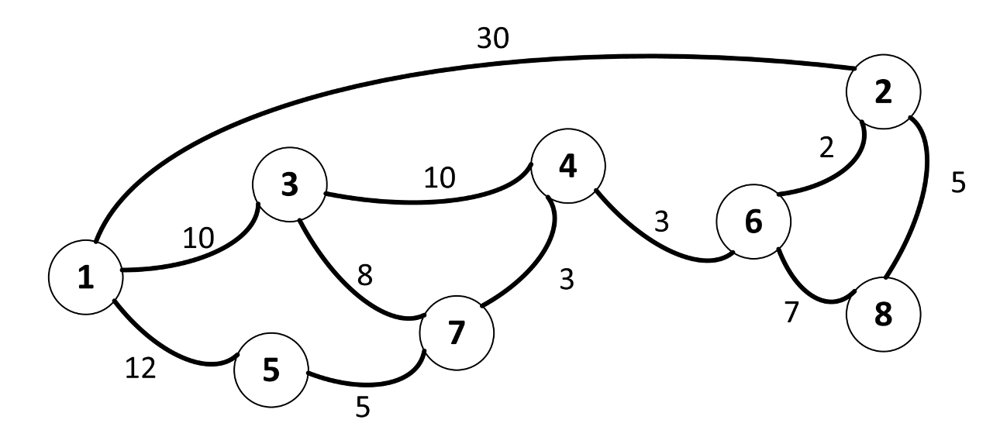

---
hide:
  - toc
---

# 5 - GPS

=== "Zadatak"
	
	| Vremensko ograničenje | Memorijsko ograničenje |
	|:-:|:-:|
	| 1000ms | 256MB |
	
	Tajna komisija nema vremena ni za šta a samim tim ni za planiranje putovanja od svoje tajne baze do mesta održavanja SIO-a. Možemo pretpostaviti da se naša država sastoji od $N$ gradova (numerisanih brojevima od $1$ do $N$) i $M$ **dvosmernih** auto-puteva između nekih od njih, **pri čemu je za svaki auto-put poznato vreme potrebno da se on pređe**. Komisija se nalazi u gradu broj $1$ a SIO se održava u gradu broj $N$.
	
	Međutim, komisija vozi poslednje čudo tehnologije - Mazdu 323 sa ugrađenim auto-vozačem,  sistemom za navigaciju (GPS), daljinskim blokiranjem auto-puteva i sertifikatom da je bolji automobil od Nissan Kaškaija. Jedna od (mnogih) mogućnosti ovog automobila je sledeća: ukoliko se trenutno nalazimo u gradu $X$ i u GPS unesemo grad $Y$, tada, **ukoliko od grada $X$ do grada $Y$ postoji jedinstvena najkraća putanja** (koja može koristiti više auto-puteva i prolaziti kroz više gradova), auto-vozač će nas odvesti tom jedinstvenom najkraćom putanjom do grada $Y$. Nažalost, **mi možemo koristiti GPS samo ako je neki od gradova $X$ ili $Y$ upravo $1$ ili $N$** (još uvek nije unešeno dovljno podataka). Naravno, osim korišćenja GPS-a/auto-vozača, moguće je voziti Mazdu na klasičan način. Takođe (videti opis mogućnosti Mazde), **moguće je blokirati najviše jedan auto put pre početka putovanja i na taj način uticati na izračunavanja GPS-a**.
	
	Cilj komisije je da stigne iz grada $1$ do grada $N$ **za najkraće moguće vreme** (prvi prioritet) ali da **pritom što manje vremena vozi na klasičan način**, bez GPS-a (drugi prioritet). Na vama je da izračunate koliko najmanje vremena se Mazda mora voziti na klasičan način, **pri čemu možete odlučiti da li ćete u obzir uzimati mogućnost blokiranja auto-puta (videti opis funkcije i bodovanje)**.
	
	## Opisi funkcija
	Potrebno je da implementirate funkciju
	
	* $NajkracaVoznja(N,M,g1[…],g2[…],t[…])$
	
	gde je $N$ – broj gradova (gradovi su numerisani od $1$ do $N$), $M$ – broj auto-puteva a $g1$, $g2$ i $t$ nizovi dužine $M$ koji opisuju auto-puteve: za svako $1\leq i\leq M$, $i$-ti auto-put povezuje gradove $g1[i]$ i $g2[i]$ i putovanje po njemu traje $t[i]$ minuta. Auto-putevi su dvosmerni a **svi nizovi su indeksirani od $1$**. 
	
	**Za maksimalan broj poena**, vaša funkcija mora da vrati jedan ceo broj – najmanje vreme koje komisija mora voziti na klasičan način ukoliko ima pravo da blokira najviše jedan auto put. **Za manji broj poena**, vaša funkcija može vratiti najmanje vreme koje komisija mora voziti na klasičan način ukoliko nema prava da blokira auto puteve; **u tom slučaju je potrebno vratiti rezultat sa predznakom “-” (minus)**. Ukoliko je rešenje 0, ne mora se stavljati predznak.
	
	## Primer 
	Neka je $N=8$, $M=11$, $g1=[1,1,5,3,3,4,6,6,4,1,8]$, $g2=[5,3,7,7,4,7,2,8,6,2,2]$ i $t=[12, 10, 5, 8, 10, 3, 2, 7, 3, 30, 5]$. Ovi podaci odgovaraju sledećoj mapi (gradovi su prikazani kao kružići a auto-putevi kao linije; pored svakog auto puta je dato vreme potrebno da se on pređe).
	
	
	
	Najmanje vremena potrebno da se stigne iz grada 1 u grad 8 (bez obzira ko vozi) je 30 minuta. Razmotrimo slučaj kada ne blokiramo nijedan auto put: tada npr. možemo u GPS-u ukucati grad broj 7 (to je ok jer je $X=1$) i kako do njega postoji jedinstvena najkraća putanja ($1\rightarrow 5\rightarrow 7$) auto vozač će nas odvesti tamo. Zatim možemo da vozimo sami do grada 2 ($7\rightarrow 4\rightarrow 6\rightarrow 2$, ukupno 8 minuta) a zatim možemo iz grada 2 ukucati u GPS grad 8 (dakle $Y=8$ pa možemo koristiti GPS) i auto vozač nas vozi u grad 8 jedinstvenom najkraćom putanjom $2\rightarrow 8$. Stigli smo do cilja za najkraće moguće vreme a pri tom smo sami vozili 8 minuta – može se pokazati da ne možemo bolje ukoliko ne blokiramo auto-puteve. Dakle, ukoliko vaša funkcija za ovaj primer vrati broj -8, dobijate 60% poena (vidi bodovanje).
	
	 Sa druge strane, ako želimo da koristimo funkciju blokiranja najviše jednog auto-puta, tada, ukoliko npr. blokiramo auto-put između 5 i 7, možemo pozvati GPS prvo za grad 2 (jedinstvena najkraća putanja $1\rightarrow 3\rightarrow 4\rightarrow 6\rightarrow 2$) a zatim iz grada 2 pozivamo GPS za grad 8. Ukupno smo sami vozili 0 minuta što je i optimalno rešenje za ovaj primer (i nosi 100% poena). Primetimo npr. da ne bi bilo korektno da uklonimo auto-put između 4 i 6 i odmah u GPS unesemo grad 8 jer bismo tada do njega stigli za 35 minuta a moramo stići za najkraće moguće vreme (30 minuta).
	
	## Ograničenja
	* $2\leq N\leq 10^5$
	* $1\leq M\leq 3⋅10^5$
	* Za svako $1\leq i\leq M$ važi $1\leq g1[i],g2[i]\leq N$, $g1[i]\neq g2[i]$ i $1\leq t[i]\leq 10^9$
	* Između svaka dva grada postoji najviše jedan auto-put.
	* Uvek će postojati način da se stigne iz grada $1$ u grad $N$.
	
	## Podzadaci i bodovanje
	U svakom podzadatku, ukoliko vaš program korektno reši varijantu problema u kome nema blokiranja auto-puteva (što se zaključuje na osnovu predznaka “-“ u povratnoj vrednosti funkcije) dobijate 60% poena od odgovarajućeg podzadatka. Ukoliko svaki test primer podzadatka vaš program rešava u varijanti gde je moguće blokirati najviše jedan auto-put, dobijate svih 100% poena tog podzadatka.
	
	* PODZADATAK 1 [11 POENA]: $N\leq 10$
	* PODZADATAK 2 [17 POENA]: $N\leq 250$ i $M\leq 500$.
	* PODZADATAK 3 [20 POENA]: $N\leq 2000$.
	* PODZADATAK 4 [21 POENA]: Za svako $1\leq i \leq M$ važi $t[i]=1$.
	* PODZADATAK 5 [31 POENA]: Nema dodatnih ograničenja.
	
	## Detalji implementacije
	Potrebno je da pošaljete tačno jedan fajl, pod nazivom gps.c, gps.cpp ili gps.pas, koji implementira gore pomenutu funkciju. Osim tražene funkcije, vaš fajl može sadržati i dodatne globalne promenljive, pomoćne funkcije i dodatne biblioteke.
	
	Zavisno od programskog jezika koji koristite, vaša funkcija/procedura mora biti sledećeg oblika:
	
	```
	C/C++
	    long long NajkracaVoznja(int N, int M, int* g1, int* g2, int* t);
	Pascal
	    function NajkracaVoznja(N, M : longint; var g1, g2, t : array of longint) : int64;
	```
	
	Ukoliko radite u C/C++-u, potrebno je na početku fajla staviti `#include “gps.h”` a ukoliko radite u Pascal-u, potrebno je na početku fajla staviti `Unit gps;` **(ovo je već dodato u fajlovima koji su vam obezbeđeni)**.
	
	## Testiranje i eksperimentisanje
	Uz zadatak, obezbeđeni su vam “template” fajlovi (gps.c, gps.cpp, gps.pas) koje možete koristiti i menjati po potrebi. Takođe su vam obezbeđeni programi (grader.c, grader.cpp, grader.pas) koji služe da lakše testirate kodove. Ovi programi učitavaju sa standardnog ulaza sledeće podatke:
	
	* U prvom redu brojeve $N$ i $M$, redom, razdvojene razmakom
	* U sledećih $M$ redova brojeve $g1[i]$,$g2[i]$,$t[i]$, redom, razdvojene razmakom
	
	a zatim pozivaju vašu funkciju NajkracaVoznja iz odgovarajućeg fajla (gps.c, gps.cpp, gps.pas) sa učitanim parametrima i na kraju vrednost koju vaša funkcija vraća ispisuju na standardni izlaz. Kodove ovih programa možete menjati po potrebi.
	
=== "Rešenje"
	
	| Autor | Tekst i test primeri | Analiza rеšenja | Testiranje |
	|:-:|:-:|:-:|:-:|
	| Nikola Milosavljević | Nikola Milosavljević | - | Aleksandar Ivanović |
	
	
	``` cpp title="05_gps.cpp" linenums="1"
	#include "gps.h"
	
	#include <cstdlib>
	#include <cstdio>
	#include <vector>
	#include <set>
	
	using namespace std;
	
	const int MAX_N = 200200;
	const long long INF = 1000000000000000LL;
	
	struct edge
	{
		int v, w;
		edge(int _v, int _w) { v = _v; w = _w; }
	};
	
	int n, m;
	vector<edge> adj[MAX_N];
	vector<edge> ADJ[2][MAX_N];
	bool uniquePath[2][MAX_N][2];
	long long d[2][MAX_N];
	long long shortest[MAX_N];
	int queue[MAX_N];
	bool mark[MAX_N];
	int topSort[2][MAX_N];
	int inDeg[MAX_N];
	int n1;
	
	int FLAG;
	
	struct cmp {
		bool operator () (const int& a, const int& b)
		{
			if (d[FLAG][a] == d[FLAG][b])
				return a < b;
			return (d[FLAG][a] < d[FLAG][b]);
		}
	};
	set<int, cmp> heap;
	
	long long Min(long long a, long long b)
	{
		return (a < b ? a : b);
	}
	
	void Dijkstra(int start, int num)
	{
		FLAG = num;
		for (int i = 1; i <= n; i++) d[num][i] = INF;
		d[num][start] = 0LL;
		heap.clear();
		heap.insert(start);
	
		while (!heap.empty())
		{
			int u = *heap.begin();
			heap.erase(heap.begin());
			for (int i = 0; i < (int)adj[u].size(); i++)
			{
				int v = adj[u][i].v;
				long long w = adj[u][i].w;
				if (d[num][v] == INF)
				{
					d[num][v] = d[num][u] + w;
					heap.insert(v);
				}
				else if (d[num][u] + w < d[num][v])
				{
					heap.erase(v);
					d[num][v] = d[num][u] + w;
					heap.insert(v);
				}
			}
		}
	}
	
	void TopSort(int start, int num)
	{
		for (int i = 1; i <= n; i++)
			inDeg[i] = ADJ[1 - num][i].size();
		queue[1] = start;
		int first = 0, last = 1;
		int c = 0;
	
		while (first < last)
		{
			first++;
			int u = queue[first];
			c++;
			topSort[num][c] = u;
			cout << u << " num " << num <<endl;
			for (int i = 0; i < (int)ADJ[num][u].size(); i++)
			{
				int v = ADJ[num][u][i].v;
				inDeg[v]--;
				if (inDeg[v] == 0)
				{
					last++;
					queue[last] = v;
				}
			}
		}
	}
	
	void FindUniquePaths(int start, int num)
	{
		for (int i = 1; i <= n; i++)
		{
			uniquePath[num][i][0] = false;
			uniquePath[num][i][1] = false;
		}
		uniquePath[num][start][0] = true;
		uniquePath[num][start][1] = true;
	
		for (int i = 1; i <= n1; i++)
		{
			int u = topSort[num][i];
			if (u == start) continue;
	
			if (ADJ[1 - num][u].size() == 1 && uniquePath[num][ ADJ[1 - num][u][0].v ][0])
				uniquePath[num][u][0] = true;
	
			if (uniquePath[num][u][0]) uniquePath[num][u][1] = true;
			if (ADJ[1 - num][u].size() == 1 && uniquePath[num][ ADJ[1 - num][u][0].v ][1])
				uniquePath[num][u][1] = true;
			if (ADJ[1 - num][u].size() == 2 && (uniquePath[num][ ADJ[1 - num][u][0].v ][0] || uniquePath[num][ ADJ[1 - num][u][1].v ][0]))
				uniquePath[num][u][1] = true;
		}
	}
	
	// najkraci put izmedju 2 skupa cvorova A i B:
	// x = 0, y = 0: A = {svi jednistveno dostizni iz 1}, B = {svi sa jedinstvenim putem ka B} (60% zadatka)
	// x = 1, y = 0: A = {svi jedinstevno dostizni iz 1 uz uklanjanje najvise 1 grane}, B = {svi sa jedinstvenim putem ka B}
	// x = 0, y = 1: A = {svi jednistveno dostizni iz 1}, B = {svi sa jedinstvenim putem ka B uz uklanjanje najvise jedne grane}
	long long Solve(int x, int y)
	{
		for (int i = 1; i <= n; i++)
		{
			if (uniquePath[0][i][x])
				shortest[i] = 0LL;
			else
				shortest[i] = INF;
		}
	
		for (int i = 1; i <= n1; i++)
		{
			int u = topSort[0][i];
			if (shortest[u] == INF)
			{
				for (int j = 0; j < (int)ADJ[1][u].size(); j++)
				{
					int v = ADJ[1][u][j].v;
					int w = ADJ[1][u][j].w;
					shortest[u] = Min(shortest[u], shortest[v] + w);
				}
			}
		}
	
		long long ret = INF;
		for (int i = 1; i <= n; i++)
			if (uniquePath[1][i][y]) ret = Min(ret, shortest[i]);
	
		return ret;
	}
	
	long long NajkracaVoznja(int N, int M, int* g1, int* g2, int* t)
	{
		n = N;
		m = M;
	
		for (int i = 1; i <= n; i++)
		{
			adj[i].clear();
			ADJ[0][i].clear();
			ADJ[1][i].clear();
		}
	
		for (int i = 1; i <= M; i++)
		{
			adj[ g1[i] ].push_back(edge(g2[i], t[i]));
			adj[ g2[i] ].push_back(edge(g1[i], t[i]));
		}
	
		// pustamo 2 dijkstre da bismo odredili dijkstra dag i grane kandidate.
		// Dovoljna je jedna dijkstra i bfs ali ovako je lakse + bolje da se podesi vreme za ovaj algoritam
		Dijkstra(1, 0);
		Dijkstra(n, 1);
	
		// Sada pravimo dijkstra DAG pri cemu se dodaju samo grane koje pripadaju nekom najkracem putu od 1 do n
		// n1 je broj "relevatnih cvorova" tj onih koji su na nekom najkracem putu od 1 do n.
		for (int i = 1; i <= M; i++)
		{
			if (d[0][ g1[i] ] + t[i] + d[1][ g2[i] ] == d[0][n]) // g1[i] -> g2[i]
			{
				ADJ[0][ g1[i] ].push_back(edge(g2[i], t[i]));
				ADJ[1][ g2[i] ].push_back(edge(g1[i], t[i]));
			}
			else if (d[0][ g2[i] ] + t[i] + d[1][ g1[i] ] == d[0][n]) // g2[i] -> g1[i]
			{
				ADJ[0][ g2[i] ].push_back(edge(g1[i], t[i]));
				ADJ[1][ g1[i] ].push_back(edge(g2[i], t[i]));
			}
		}
		n1 = 0;
		for (int i = 1; i <= n; i++)
			if (d[0][i] + d[1][i] == d[0][n]) n1++;
	
		// Odradimo topoloski sort u dijkstra dag-u (opet je dovoljan samo jedan ali simetrija)
		// Ovo pomaze da posle umesto BFS-a/dodatne Dijkstre, imamo samo for petlju
		TopSort(1, 0);
		TopSort(n, 1);
	
		// Nalazimo cvorovove do/od kojih postoje najkraci putevi sa i bez uklanjanja jedne grane
		// Za jedinstvenost od cvora 1 nam trebaju "suprotno" usmerene ivice pa koristimo izraze 1-num
		FindUniquePaths(1, 0);
		FindUniquePaths(n, 1);
	
		long long sol = Min(Solve(0, 1), Solve(1, 0)); // optimalno resenje
		// long long sol = Solve(0, 0); // za 60% poena
		return sol;
	}
	

	```
