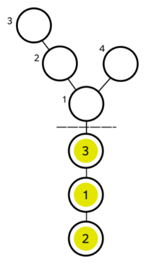

---
hide:
  - toc
---

# A2 - Sort na stablu

=== "Zadatak"
	
	| Vremensko ograničenje | Memorijsko ograničenje |
	|:-:|:-:|
	| 2000ms | 256MB |
	
	Nakon potpunog uništenja Pajazitova, duh Milojica je rešio da počasti svoju decu zlatnicima. On je spremio za svako od $n$ dece po jedan zlatnik. Zlatnici su numerisani brojevima od $1$ do $n$, i na svakom zlatniku je napisan njegov jedinstven broj. Broj na zlatniku označava indeks deteta kojem je Milojica namenio taj zlatnik. Kako su mali duhovi veoma disciplinovana stvorenja oni su se poređali u niz dužine $n$ sortirano rastuće po indeksu. Nažalost, Milojica nije verovao u svoju decu i zlatnike je poređao u nekom poretku koji ne mora biti rastući. Da bi izbegao nezadovoljstvo svoje dece, on mora sortirati niz zlatnika u rastućem poretku. Za ovaj poduhvat on koristi jedno stablo sa $m$ čvorova koje je preko korena (čvora numerisanog sa $1$) povezano sa prvom pozicijom u nizu zlatnika.
	
	U jednom potezu Milojica može pomeriti jedan zlatnik na susedno polje ako se u tom trenutku na tom polju ne nalazi nijedan zlatnik. Pod poljem smatramo neku poziciju u nizu zlatnika ili neki čvor u stablu. Primetimo da sa pozicije $1$ u nizu, zlatnik možemo pomeriti na poziciju $2$ ili u koren stabla. Slično, iz korena stabla zlatnik možemo pomeriti u neko od njegove dece ili na poziciju $1$ u nizu.
	
	Postavlja se jednostavno pitanje: Da li Milojica nakon konačno mnogo koraka može rastuće sortirati svoje zlatnike? Kako su duhovi malo zaboravna bića, Milojica nije siguran koji je tačno poredak zlatnika ostavio i kako izgleda stablo povezano sa nizom, pa vas je zamolio da odgovorite na traženo pitanje za $t$ različitih rasporeda zlatnika i izgleda stabla.
	
	
	## Opis ulaza
	U prvoj liniji standardnog ulaza nalazi se prirodan broj $t$, broj upita za koje želimo da ispitamo mogućnost sortiranja.
	 
	Svaki upit je opisan na sledeći način:
	
	U prvoj liniji upita nalazi se prirodan broj $n$, broj zlatnika i broj Milojičine dece.
	
	U drugoj liniji upita nalazi se permutacija brojeva $\{1, 2, \dots, n\}$: $p_1, p_2, \dots, p_n$, početni raspored zlatnika u nizu.
	
	U trećoj liniji upita nalazi se prirodan broj $m$, broj čvorova u stablu.
	
	Narednih $m-1$ linija sadrže po dva broja $u_i$, $v_i$, parove povezanih čvorova u stablu.  
	
	## Opis izlaza
	Na standardni izlaz ispisati $t$ linija koje predstavljaju odgovore na upite. U $i$-toj liniji ispisati `DA` ako je u $i$-tom upitu moguće rastuće sortirati niz zlatnika, a u suprotnom ispisati `NE`.
	
	## Primer 1
	### Ulaz
	```
	2
	3
	3 1 2
	4
	1 2
	2 3
	1 4
	3
	3 2 1
	2
	2 1
	```
	
	### Izlaz
	```
	DA
	NE
	```
	
	## Objašnjenje primera
	
	
	
	Prvi upit izgleda kao na slici. Milojica ima tri deteta i tri zlatnika. Zlatnici su poređani u redosledu $[3, 1, 2]$. Stablo ima četiri čvora. 
	
	Jedan od mogućih algoritama sortiranja bi imao sledeće korake:
	
	1. Pomeriti zlatnik sa brojem $3$ koji se nalazi na poziciji $1$ u nizu najpre u koren stabla (čvor numerisan sa $1$), nakon toga u čvor numerisan sa $4$.
	2. Pomeriti zlatnik sa brojem $1$ koji se nalazi na poziciji $2$ u nizu najpre na poziciju $1$ u nizu, nakon toga u koren stabla, potom u čvor numerisan sa $2$ i na kraju u čvor numerisan sa $3$.
	3. Pomeriti zlatnik sa brojem $2$ koji se nalazi na poziciji $3$ u nizu najpre na poziciju $2$, nakon toga na poziciju $1$, posle toga u koren stabla i najzad u čvor numerisan sa $2$.
	4. Vratiti zlatnik sa brojem $3$ koji se nalazi u čvoru numerisanom sa $4$ prvo u koren stabla, nakon toga na poziciju $1$ u nizu, pa na poziciju $2$ i na kraju na poziciju $3$.
	5. Vratiti zlatnik sa brojem $2$ koji se nalazi u čvoru numerisanom sa $2$ prvo u koren stabla, nakon toga na poziciju $1$ u nizu i na kraju na poziciju $2$.
	6. Vratiti zlatnik sa brojem $1$ koji se nalazi u čvoru numerisanom sa $3$ prvo u čvor numerisan sa $2$, nakon toga u koren stabla i na kraju na poziciju $1$ u nizu.
	
	Nakon navedenih operacija niz zlatnika će biti sortiran rastuće, pa je odgovor na ovaj upit `DA`.
	
	U drugom upitu imamo permutaciju zlatnika sortiranu u opadajućem poretku i stablo sa dva čvora. Kako god pomerali zlatnike nije moguće sortirati ih rastuće, pa je odgovor `NE`.
	
	## Ograničenja i podzadaci
	
	* $1 \leq t \leq 7$.
	* $1 \leq n,m \leq 10^5$.
	* $1\leq p_i \leq n$.
	* $1 \leq u_i, v_i \leq m$.
	* $u_i \neq v_i$.
	
	Postoje četiri podzadatka:
	
	* Podzadatak $1$ [$12$ poena]:  $n=3$, $m=4$.
	* Podzadatak $2$ [$18$ poena]: $1 \leq n\leq 5$, $1\leq m \leq 7$.
	* Podzadatak $3$ [$25$ poena]: Samo koren stabla može da ima više od jednog deteta.
	* Podzadatak $4$ [$45$ poena]: Nema dodatnih ograničenja.
	
	## Napomena
	
	Stablo je neusmeren povezan graf sa $m$ čvorova i $m-1$ veza. Koren stabla je čvor koji nema svog pretka u stablu.
	
=== "Rešenje"
	
	| Autor | Tekst i test primeri | Analiza rеšenja | Testiranje |
	|:-:|:-:|:-:|:-:|
	| Dušan Živanović | Aleksa Plavšić | Nikola Jovanović | Nikola Jovanović |
	
	Ako razmislimo o načinima na koje se stablo može koristiti pri sortiranju prirodno se nameću zamene, pa umesto originalnog problema sortiranja posmatrajmo prvo problem zamene dva susedna elementa iz niza, konkretno zlatnika na indeksima $k-1$ i $k$. Nazovimo čvor stabla najbliži korenu koji ima više od jednog sina *račva*. Zamenu zlatnika vršimo tako što premestimo deo niza zaključno sa indeksom $k-2$ negde u dubinu stabla, zatim postavimo zlatnike sa indeksima $k-1$ i $k$ u različita podstabla račve, vratimo ih u niz u obrnutom redosledu, i zatim vratimo deo niza zaključno sa indeksom $k-2$ (istim redom). Potreban i dovoljan uslov za ovo je da podstablo račve (ne uključujući samu račvu) ima barem $k$ elemenata. Lako se vidi da u suprotnom zlatnici na indeksima $k-1$ i $k$ nikada ne mogu zameniti mesta.
	
	Sada kada znamo proceduru za zamenu dva susedna zlatnika algoritmom nalik na _bubble sort_ izvodimo sortiranje celog niza. Sortiranje je moguće ukoliko je moguća zamena para susednih zlatnika sa najvećim indeksima (primetimo da ovo nisu uvek zlatnici $n-1$ i $n$, jer neki sufiks niza može biti već sortiran). Prostim poređenjem veličine podstabla račve i indeksa poslednjeg zlatnika koji nije na svom mestu dobijamo odgovor na upit.
	
	## Smernice za algoritam
	
	Oba broja potrebna za rešavanje upita možemo jednostavno naći. Jednim prolazom kroz niz zlatnika nalazimo poslednji indeks $k$ takav da je $p_k \neq k$. Prolaskom kroz stablo nalazimo račvu i veličinu odgovarajućeg podstabla, $R$. Za $R >= k$ ispisujemo $DA$, a u suprotnom $NE$. U zadacima sa više upita tj. više test primera po jednom pokretanju programa važno je posebnu pažnju obratiti na globalno stanje programa koje je neophodno reset-ovati između test primera. U ovom zadatku bi primer bio broj dece za svaki čvor u stablu - ukoliko zaboravimo da anuliramo ovo polje možemo dobiti neočekivane rezultate.
	
	``` cpp title="05_sort_na_stablu.cpp" linenums="1"
	#include<bits/stdc++.h>
	
	using namespace std;
	
	const int maxi=1e6+2;
	vector<int> v[maxi];
	int ans,n,m;
	int p[maxi];
	
	void ocisti()
	{
	    for (int i=1; i<=m;i++)
	        v[i].clear();
	    ans=0;
	}
	void dfs(int x, int pred)
	{
	    int sz=0;
	    int last=0;
	    ans++;
	    for (int i:v[x])
	        if (i!=pred)
	        {
	            sz++;
	            last=i;
	        }
	
	    if (sz==1) dfs(last,x);
	    return;
	}
	
	void solve()
	{
	    scanf("%d",&n);
	
	    for (int i=1; i<=n; i++)
	        scanf("%d",&p[i]);
	
	    scanf("%d",&m);
	    ocisti();
	    
	    for (int i=1; i,i<m; i++)
	    {
	        int x,y;
	        scanf("%d%d",&x,&y);
	        v[x].push_back(y);
	        v[y].push_back(x);
	    }
	
	    int poz=0;
	    for (int i=1; i<=n; i++)
	        if (p[i]!=i) poz=i;
	
	    dfs(1,0);
	    ans=m-ans;
	    if (ans>=poz) printf("DA\n");
	    else
	        printf("NE\n");
	
	    return;
	}
	int main()
	{
	    int t;
	    cin>>t;
	
	    while(t--)
	        solve();
	
	    return 0;
	}

	```
