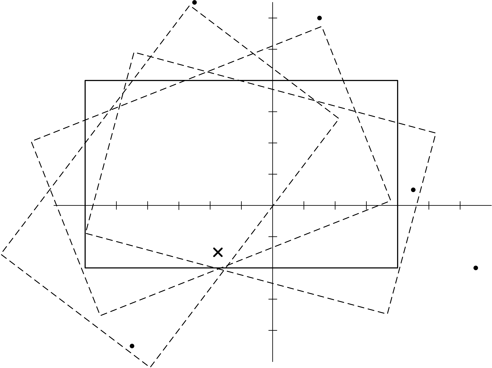

Познато је да сваки нови члан Комисије мора да положи древни испит искушења како би постао пуноправни члан и уједно научио да вози. Испитом искушења руководи древни члан комисије - Инструктор, а испит се полаже на следећи начин. У равни се постави комисиомобил (кога можемо замислити као правоугаоник са страницама паралелним координатним осама) и $N$ такмичара који су писали бар једну жалбу (које можемо замислити као тачке јер су мали и безначајни). Кандидат седа у комисиомобил и циљ је да потисне своју мржњу према жалбама и не обори ниједног такмичара. Пролазност на испиту је врло ниска...

Дошао је ред и на младог Зокија Обарача да проба да положи испит. Међутим, Инструктор зна да је Зокијева мржња према жалбама превише јака и да ће овог пута бити озбиљнијих повреда. Зато је одлучио да блокира комисиомобил тако што ће пробости свој древни анти-жалбени штап **кроз једну његову тачку (унутар или на ивици правоугаоника) - тиме ће комисиомобил моћи само да се (стално) окреће око те тачке**. Наравно, могуће је да ће тим окретањем бити оборено неколико такмичара - **кажемо да је такмичар оборен ако се у неком тренутку нађе унутар или на граници комисиобила док се овај окреће**. Инструктор рачуна да је то боље него дати Зокију одрешене руке...

На вама је да помогнете Инструктору -- **одредите колико најмање такмичара мора бити оборено при оптималном избору тачке пробадања правоугаоника**. Уколико помогнете Инструктору, добијате веће шансе за преживљавање уколико се жалите и будете изабрани као статисти за неки од будућих испита...

## Опис улаза
У првом реду стандардног улаза налази се природан број $N$ - број такмичара. У наредном реду налазе се 4 цела броја $X$, $Y$, $A$ и $B$ која представљају, редом, координате горњег-левог темена правоугаоника (комисиобила) и његову ширину и висину. У наредних $N$ редова налазе се по два цела броја $(x_i, y_i)$ која представљају координате одговарајућег такмичара.

## Опис излаза
У први и једини ред стандардног излаза исписати ненегативан цео број $K$ -- најмањи број такмичара који мора бити оборен при оптималном избору тачке пробадања комисиобила (**обратити пажњу да оптимална тачка пробадања не мора имати целобројне координате у општем случају**).

## Пример 1
### Улаз
```
5
-12 8 20 12
9 1
-9 -9
3 12
13 -4
-5 13
```

### Излаз
```
2
```

## Објашњење примера



Правоугаоник (комисиомобил) је димензија $20 \times 12$, горње лево теме му је $(-12, 8)$ и почетна позиција му је представљена пуном линијом. Уколико за тачку пробадања изаберемо тачку $(-3.5, -3)$ (означена 'X' на слици) тада ће правоугаоник, окретањем око те тачке оборити првог и другог такмичара а остали ће избећи незгоду. Постоје и други избори тачке пробадања за које су оборена само два такмичара али не постоји ниједан избор тако да буде оборен највише један такмичар; дакле, решење је $2$.

## Ограничења и подзадаци

* $1 \leq N \leq 10^5$.
* $-10^7 \leq X, Y \leq 10^7$.
* $2 \leq A, B \leq 10^7$, $A$ и $B$ су парни бројеви.
* $-10^7 \leq x_i, y_i \leq 10^7$.
* Ниједна од $N$ тачака на улазу не припада правоугаонику.
* Могуће је да се два или више такмичара налазе на истој позицији.

Постоји пет подзадатака:

* Подзадатак $1$ [$6$ поена]: За сваког такмичара важи $y_i > Y$.
* Подзадатак $2$ [$11$ поена]: $N = 2$.
* Подзадатак $3$ [$15$ поена]: Решење ће увек бити $0$ или $1$.
* Подзадатак $4$ [$29$ поена]: $N \leq 10^3$.
* Подзадатак $5$ [$39$ поена]: Нема додатних ограничења.
