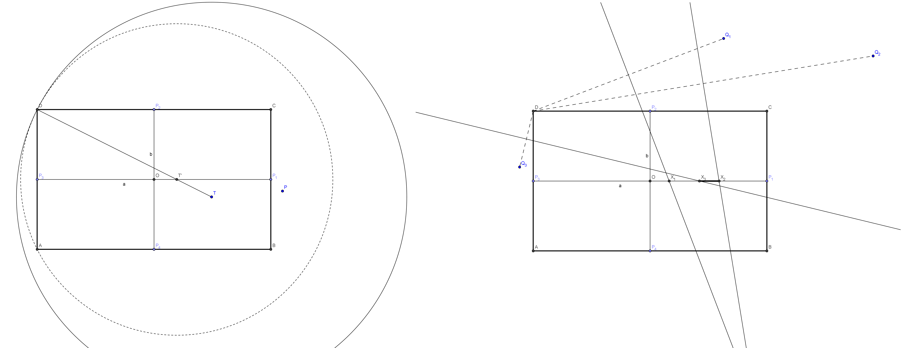

---
hide:
  - toc
---

# A3 - Obaranje

=== "Zadatak"
	
	| Vremensko ograničenje | Memorijsko ograničenje |
	|:-:|:-:|
	| 1000ms | 64MB |
	
	Poznato je da svaki novi član Komisije mora da položi drevni ispit iskušenja kako bi postao punopravni član i ujedno naučio da vozi. Ispitom iskušenja rukovodi drevni član komisije - Instruktor, a ispit se polaže na sledeći način. U ravni se postavi komisiomobil (koga možemo zamisliti kao pravougaonik sa stranicama paralelnim koordinatnim osama) i $N$ takmičara koji su pisali bar jednu žalbu (koje možemo zamisliti kao tačke jer su mali i beznačajni). Kandidat seda u komisiomobil i cilj je da potisne svoju mržnju prema žalbama i ne obori nijednog takmičara. Prolaznost na ispitu je vrlo niska...
	
	Došao je red i na mladog Zokija Obarača da proba da položi ispit. Međutim, Instruktor zna da je Zokijeva mržnja prema žalbama previše jaka i da će ovog puta biti ozbiljnijih povreda. Zato je odlučio da blokira komisiomobil tako što će probosti svoj drevni anti-žalbeni štap **kroz jednu njegovu tačku (unutar ili na ivici pravougaonika) - time će komisiomobil moći samo da se (stalno) okreće oko te tačke**. Naravno, moguće je da će tim okretanjem biti oboreno nekoliko takmičara - **kažemo da je takmičar oboren ako se u nekom trenutku nađe unutar ili na granici komisiobila dok se ovaj okreće**. Instruktor računa da je to bolje nego dati Zokiju odrešene ruke...
	
	Na vama je da pomognete Instruktoru -- **odredite koliko najmanje takmičara mora biti oboreno pri optimalnom izboru tačke probadanja pravougaonika**. Ukoliko pomognete Instruktoru, dobijate veće šanse za preživljavanje ukoliko se žalite i budete izabrani kao statisti za neki od budućih ispita...
	
	## Opis ulaza
	U prvom redu standardnog ulaza nalazi se prirodan broj $N$ - broj takmičara. U narednom redu nalaze se 4 cela broja $X$, $Y$, $A$ i $B$ koja predstavljaju, redom, koordinate gornjeg-levog temena pravougaonika (komisiobila) i njegovu širinu i visinu. U narednih $N$ redova nalaze se po dva cela broja $(x_i, y_i)$ koja predstavljaju koordinate odgovarajućeg takmičara.
	
	## Opis izlaza
	U prvi i jedini red standardnog izlaza ispisati nenegativan ceo broj $K$ -- najmanji broj takmičara koji mora biti oboren pri optimalnom izboru tačke probadanja komisiobila (**obratiti pažnju da optimalna tačka probadanja ne mora imati celobrojne koordinate u opštem slučaju**).
	
	## Primer 1
	### Ulaz
	```
	5
	-12 8 20 12
	9 1
	-9 -9
	3 12
	13 -4
	-5 13
	```
	
	### Izlaz
	```
	2
	```
	
	## Objašnjenje primera
	
	
	
	Pravougaonik (komisiomobil) je dimenzija $20 \times 12$, gornje levo teme mu je $(-12, 8)$ i početna pozicija mu je predstavljena punom linijom. Ukoliko za tačku probadanja izaberemo tačku $(-3.5, -3)$ (označena 'X' na slici) tada će pravougaonik, okretanjem oko te tačke oboriti prvog i drugog takmičara a ostali će izbeći nezgodu. Postoje i drugi izbori tačke probadanja za koje su oborena samo dva takmičara ali ne postoji nijedan izbor tako da bude oboren najviše jedan takmičar; dakle, rešenje je $2$.
	
	## Ograničenja i podzadaci
	
	* $1 \leq N \leq 10^5$.
	* $-10^7 \leq X, Y \leq 10^7$.
	* $2 \leq A, B \leq 10^7$, $A$ i $B$ su parni brojevi.
	* $-10^7 \leq x_i, y_i \leq 10^7$.
	* Nijedna od $N$ tačaka na ulazu ne pripada pravougaoniku.
	* Moguće je da se dva ili više takmičara nalaze na istoj poziciji.
	
	Postoji pet podzadataka:
	
	* Podzadatak $1$ [$6$ poena]: Za svakog takmičara važi $y_i > Y$.
	* Podzadatak $2$ [$11$ poena]: $N = 2$.
	* Podzadatak $3$ [$15$ poena]: Rešenje će uvek biti $0$ ili $1$.
	* Podzadatak $4$ [$29$ poena]: $N \leq 10^3$.
	* Podzadatak $5$ [$39$ poena]: Nema dodatnih ograničenja.
	
=== "Rešenje"
	
	| Autor | Tekst i test primeri | Analiza rеšenja | Testiranje |
	|:-:|:-:|:-:|:-:|
	| Nikola Milosavljević | Nikola Milosavljević | Nikola Milosavljević | Dušan Zdravković |
	
	Označimo (proizvoljnu) tačku probadanja sa $T$ i neka je njeno rastojanje do najudaljenijeg temena pravougaonika jedanko $r_T$. Nije teško zaključiti da, okretanjem oko tačke probadanja, pravougaonik pokriva površ koja je zapravo krug $K(T, r_T)$ sa centrom u $T$ i poluprečnikom $r_T$. Dakle, treba izabrati tačku $T$ unutar pravougaonika takvu da krug (uključujući i granicu) $K(T, r_T)$ sadrži što manje od datih $N$ tačaka; označimo broj tačka unutar pomenutog kruga sa $c(T)$ a sa $opt$ - optimalno rešenje (koje treba izračunati).
	
	Neka su temena pravougaonika $ABCD$, njegov centar $O$ a $P_1$, $P_2$, $P_3$ i $P_4$, redom, središta stranica $BC$, $CD$, $DA$ i $AB$. Označimo sa $a$ duž $P_1P_3$ (horizontalna srednja linija) a sa $b$ duž $P_2P_4$ (vertikalna srednja linija). Neka su tačke u kojima su takmičari $Q_1, Q_2, \ldots, Q_N$. Iako se najmanja vrednost $r_T$ dostiže kada je $T = O$, nama nije bitan samo poluprečnik već i pozicija kruga. Sledeća lema predstavlja ključno zapažanje:
	
	**Lema:** Postoji tačka $T$ koja pripada $a \cup b$ i za koju je $c(T) = opt$.
	
	Zaista, posmatrajmo bilo koju optimalnu tačku probadanja $T$ -- neka je, bez umanjenja opštosti, u donjem-desnom "kvadrantu" tj. pravougaoniku $P_4BP_1O$. Tada je odgovarajući krug $K(T, |TD|)$. Neka je $T'$ presečna tačka duži $TD$ i $a \cup b$ (ako ih ima više, neka je to presečna tačka bliža $T$). Nije teško uočiti da se probadanjem u tački $T'$ dobija krug $K'(T', |T'D|)$ koji je ceo sadržan u krugu $K(T, |TD|)$ pa važi $c(T') \leq c(T)$. Dakle, zaista je dovoljno razmatrati samo tačke na "srednjim linijama pravougaonika" za optimalnu tačku probadanja.
	
	Najlakši način je razlikovanje 4 slučaja tj. traženje optimalne tačke na dužima $OP_1$, $OP_2$, $OP_3$ i $OP_4$. Razmotrimo slučaj kada je tačka $T$ na $OP_1$ -- tada će poluprečnik kruga biti $|TD|$. Neka su $x$-koordinate tačaka $O$ i $P_1$, redom, $L$ i $R$. Neka je $Q_i$ proizvoljna tačka i neka je $X_i$ presek duži $OP_1$ i simetrale duži $Q_iD$ (ukoliko presek postoji). Da bi tačka $Q_i$ bila van kruga $K(T, |TD|)$, tačka $T$ mora biti sa "prave strane" tačke $X_i$; preciznije, ako je $Q_i$ "levo" od stranice $CD$, mora važiti $T \in (X_i, R)$ a ako je $Q_i$ "desno" od $CD$, mora važiti $T \in (L, X_i)$. 
	
	
	
	Na ovaj način dobijamo najviše $N$ podintervala intervala $(L, R)$ i zadatak se svodi na odabir tačke iz $(L, R)$ koju sadrži najviše pomenutih intervala (odgovarajući krug sa centrom u toj tački neće sadržati tačno one tačke koje odgovaraju intervalima koje sadrže taj centar). Ovo se može rešiti na nekoliko načina a najlakši je sortirati krajeve intervala, svim levim krajevima dodeliti $+1$, svim desnim $-1$ i odabrati tačku tako da je suma krajeva intervala levo od nje najveća moguća. Složenost ovog algoritma je $O(N \log N)$ zbog sortiranja.
	
	Za lakšu implementaciju pomenutog algoritma, korisno je na početku translirati sliku tako da je centar pravougaonika u $(0,0)$. Dodatno, isti algoritam se može iskoristiti 4 puta (uvek traženje centra na duži $OP_1$) pri čemu se pre svakog poziva cela slika rotira $90^\circ$ ulevo. Traženje odgovarajućih tačaka $X_i$ na duži $OP_1$ se može uraditi jednostavnom analitičkom geometrijom (ukoliko je slika centrirana i za tačku $Q_i=(x_i,y_i)$ važi $x_i \neq x_D$, tada je presek odgovarajuće simetrale sa $x$-osom upravo u tački $X_i = \frac{1}{2}(\frac{(y_i - y_D)(y_i+y_D) + (x_i + x_D)(x_i -x_D)}{x_i - x_D})$ ); vrednost $X_i$ je moguće odrediti i ternarnom pretragom - traženje tačke (na datoj duži) koja je podjednako udaljena od $D$ i $Q_i$.
	
	**Podzadaci:** za prvi podzadatak je uvek optimalno da centar bude u središtu duži $AB$ (donja stranica pravougaonika). Za drugi podzadatak je dovoljna analiza nekoliko slučajeva (što se svodi na proveru da li dva intervala imaju presek). U trećem podzadatku je dovoljno ispitati da li postoji tačka koja je sadržana u svim intervalima što se može uraditi jednostavnije u $O(N)$; takođe, moguć je i sledeći pristup: za svaku tačku $Q_i$ odredimo geometrijsko mesto tačaka optimalnog centra tako da odgovarajući krug ne sadrži datu tačku - može se pokazati da je taj skup tačaka u opštem slučaju četvorougao; zatim proverimo da li je presek svih takvih skupova neprazan. U četvrtom podzadatku je je dovoljno odrediti traženu tačku na intervalu $(L,R)$ u složenosti $O(N^2)$.
	
	
	
	``` cpp title="06_obaranje.cpp" linenums="1"
	#include <cstdlib>
	#include <cstdio>
	#include <cmath>
	#include <algorithm>
	#include <vector>
	
	using namespace std;
	
	const int MAX_N = 100010;
	const double EPS = 1e-8;
	
	struct point
	{
		point() {}
		point(int x1, int y1) : x(x1), y(y1) {}
		int x, y;
	};
	
	struct pointVal
	{
		pointVal() {}
		pointVal(double x1, int v1) : x(x1), val(v1) {}
		double x;
		int val;
	};
	
	point points[MAX_N];
	int n;
	int x, y, a, b;
	int opt_sol;
	
	double eq(double a, double b)
	{
		return (fabs(a - b) < EPS);
	}
	
	bool cmp(pointVal& A, pointVal& B)
	{
		if (!eq(A.x, B.x))
			return A.x < B.x;
		return A.val > B.val;
	}
	
	// rotacija za 90 stepeni ulevo, (x, y) -> (-y, x)
	void rotatePlane(int n, int& w, int& h, point p[])
	{
		swap(w, h);
		w = -w; h = -h;
		for (int i = 1; i <= n; i++)
		{
			swap(p[i].x, p[i].y);
			p[i].x = -p[i].x;
		}
	}
	
	int outside(int cx, int cy, int x, int y, int n, point p[])
	{
		int ret = 0;
		long long rSqr = ((long long)cx - x) * ((long long)cx - x) + ((long long)cy - y) * ((long long)cy - y);
		for (int i = 1; i <= n; i++)
		{
			long long distSqr = ((long long)cx - p[i].x) * ((long long)cx - p[i].x) + ((long long)cy - p[i].y) * ((long long)cy - p[i].y);
			if (distSqr > rSqr) ret++;
		}
		return ret;
	}
	
	// (w, h) - gornje-levo teme pravougaonika, centar u (0, 0)
	// trazimo optimalan centar na duzi (0,0) - (0, -w) (centar pravougaonika - sredina desne strane)
	void solveLine(int n, int w, int h, point p[])
	{
		opt_sol = max(opt_sol, outside(-w, 0, w, h, n, p)); // proverimo desni kraj
	
		double L = 0.0, R = -w;
		vector<pointVal> v; v.clear();
		for (int i = 1; i <= n; i++)
		{
			if (p[i].x == w)
			{
				v.push_back(pointVal(L, 1));
				v.push_back(pointVal(R, -1));
				continue;
			}
	
			double x = (((double)p[i].y - h) / ((double)p[i].x - w) * ((double)p[i].y + h) + ((double)p[i].x + w)) / 2;
	
			if (p[i].x > w && x > L)
			{
				v.push_back(pointVal(L, 1));
				v.push_back(pointVal(min(x, R), -1));
			}
			if (p[i].x < w && x < R)
			{
				v.push_back(pointVal(max(L, x), 1));
				v.push_back(pointVal(R, -1));
			}	
		}
	
		if (v.size() > 0)
		{
			sort(v.begin(), v.end(), cmp);
			int sum = 0, maxSum = -1, optInd = 0;
			for (int i = 0; i < (int)v.size() - 1; i++)
			{
				sum = sum + v[i].val;
				if (!eq(v[i].x, v[i + 1].x))
				{
					if (sum > maxSum)
					{
						maxSum = sum;
						optInd = i;
					}
				}
			}
			opt_sol = max(opt_sol, maxSum);
		}
	}
	
	int solve(int n, int a, int b, int x, int y, point p[])
	{
		// centriranje pravougaonika i ostalih tacaka
		int w = -a / 2, h = b / 2; // (koordinata novog gornjeg-levog temena)
		for (int i = 1; i <= n; i++)
		{
			p[i].x = p[i].x + (w - x);
			p[i].y = p[i].y + (h - y);
		}
		
		opt_sol = outside(0, 0, w, h, n, p); // provera za centar
	
		solveLine(n, w, h, p);
		rotatePlane(n, w, h, p);
		solveLine(n, w, h, p);
		rotatePlane(n, w, h, p);
		solveLine(n, w, h, p);
		rotatePlane(n, w, h, p);
		solveLine(n, w, h, p);
	
		return opt_sol;
	}
	
	int main()
	{
		scanf("%d", &n);
		scanf("%d%d%d%d", &x, &y, &a, &b);
		for (int i = 1; i <= n; i++)
		{
			scanf("%d%d", &points[i].x, &points[i].y);
		}
	
		int sol = solve(n, a, b, x, y, points);
		printf("%d\n", n - sol);
		return 0;
	}

	```
