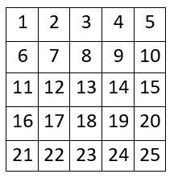
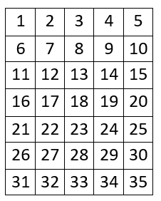

Ближи се финале светског првенства и организатори су забринути за безбедност на трибинама. Наиме постоји шанса да дође до сукоба између навијача супарничких тимова. Зато је одлучено да се направи револуционарни распоред трибина. 

Седишта трибина су распоређена у $N$ редова са по $M$ седишта. Могуће је пролазити између било која два седишта, као и са спољашњих страна ивичних седишта (ово можемо посматрати као $N \times M$ матрицу, где поља представљају седишта, а ивице путеве). Организатори желе да поставе редаре на нека од седишта тако да сви путеви буду обезбеђени. Сваки редар чува 4 пута око свог седишта. Организатори од вас траже да нађете минималан број редара који је потребан да се ово уради.

## Опис улаза
У једином реду стандардног улаза се налазе бројеви $N$ и $M$ - број редова и број седишта по реду.

## Опис излаза
У једином реду стандардног излаза исписати минималан број редара потребан да се обезбеде трибине.

## Пример 1
### Улаз
```
5 5
```

### Излаз
```
20
```

## Пример 2
### Улаз
```
7 5
```

### Излаз
```
27
```

## Објашњење primera
U prvom primeru, nумеришимо трибине на следећи начин:



Један могућ распоред редара је да се редари сместе на седишта $1, 2, 3, 4, 5, 6, 8, 10, 11, 12, 14, 15, 16, 18, 20, 21, 22, 23, 24, 25$.

U drugom primeru nумеришимо трибине на следећи начин:



Један могућ распоред редара је да се редари сместе на седишта $1, 2, 3, 4, 5, 6, 8, 10, 11, 12, 14, 15, 16, 18, 20, 21, 22, 24, 25, 26, 28, 30, 31, 32, 33, 34, 35$.

## Ограничења

- $1 \leq N, M \leq 10^9$.

Тест примери су подељени у пет дисјунктних група:

- У тестовима вредним 20 поена: $N = 3$.
- У тестовима вредним 20 поена: $N, M \leq 5$.
- У тестовима вредним 20 поена: $N = M$.
- У тестовима вредним 20 поена: $N \times M \leq 2 \times 10^5$.
- У тестовима вредним 20 поена: Без додатних ограничења.
